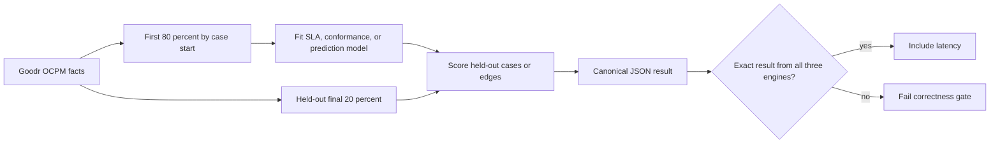

# Three-way common process-mining benchmark on Goodr

## Executive result

This benchmark measures eight common process-mining operations over the same
Goodr-derived facts in three PostgreSQL serving designs: index-light relational
PostgreSQL, the current 27-index Vertical Bar relational layout, and PostgreSQL
with `pg_ocpm 0.2.0`.

All three engines returned identical canonical results for **8/8** workloads.
Across the complete suite, `pg_ocpm` delivered a **4.48x** geometric-mean p50
speedup over vanilla PostgreSQL and **4.33x** over Vertical Bar optimized. It
was fastest in seven workloads. Vertical Bar optimized won repeated-transition
rework; `pg_ocpm` was 0.96x vanilla and 0.95x Vertical Bar on that row-heavy
self-join workload.

| Result | Vanilla PostgreSQL | Vertical Bar optimized | PostgreSQL with `pg_ocpm` |
|---|---:|---:|---:|
| Exact-result matches | **8/8** | **8/8** | **8/8** |
| Workload wins | 0/8 | 1/8 | **7/8** |
| Geometric-mean p50 speed versus vanilla | 1.00x | 1.04x | **4.48x** |
| Geometric-mean p50 speed versus Vertical Bar | 0.97x | 1.00x | **4.33x** |
| Serving indexes | **0.0 MiB** | 2,010.0 MiB | **146.0 MiB** |
| Comparable serving storage | 1,818.6 MiB | 3,831.8 MiB | **689.7 MiB** |

The machine-readable result is
[`results/common-pm-goodr-three-way-2026-07-18.json`](results/common-pm-goodr-three-way-2026-07-18.json)
(SHA-256 `52aa25f4f16612ae7702c2987bc9092157b2ab5174d07e4441b179b6be28c6b7`).

## Workloads and definitions

| Workload | Operation measured | Output |
|---|---|---|
| Edge bottleneck ranking | Rank directly-follows pairs with at least 100 occurrences by mean duration | Frequency, mean, median, min, max, and standard deviation |
| Bottleneck monthly drift | Track the slowest qualifying pair over calendar months | Monthly frequency, mean, and median duration |
| Repeated-transition rework | Find cases containing the same directly-follows pair more than once | Rework cases, excess transitions, and top repeated pairs |
| SLA breach detection | Fit a per-object-type p90 case-duration threshold on training cases and apply it to held-out cases | Breach count, rate, threshold, and mean breach duration |
| DFG conformance | Build the smallest training directly-follows model covering 95 percent of edges and score held-out edges | Fitness, deviations, model size, and top deviations |
| Variant conformance | Build the smallest training variant set covering 95 percent of cases and score held-out cases | Fitness, deviations, model size, and top variants |
| Next-activity prediction | Fit the most frequent target per source activity and edge type, then score held-out edges | Accuracy and per-source predictions |
| Edge bottleneck prediction | Fit duration and slow-transition risk by source activity, source object type, and edge type | MAE, RMSE, precision, recall, and Brier score |

The conformance workloads are frequency-covered DFG and complete-variant
conformance. They are not Petri-net token replay or trace alignment. The two
prediction workloads are deterministic SQL baselines designed to measure
process-mining training and scoring access paths. They are not production ML
quality claims.

## Temporal evaluation and correctness

Cases are ordered by start time and split at the 80th percentile. The split is
`2026-05-25 15:23:04+00:00`; model fitting reads only the earlier period and
evaluation reads only the held-out period. Both model construction and scoring
are inside the measured database query.

The suite implementation and SQL are versioned in
[`goodr_common_pm_three_way.py`](../benchmarks/goodr_common_pm_three_way.py).
The scenario registry is defined at
[`SCENARIOS`](../benchmarks/goodr_common_pm_three_way.py#L819), while the
randomized timing and exact-result gate are in
[`main()`](../benchmarks/goodr_common_pm_three_way.py#L1086).

## Latency results

Values are client-observed database-query milliseconds. Speedup is computed
from p50 latency; values above 1.00x favor the named candidate.

| Common PM workload | Vanilla p50 / p95 ms | Vertical Bar p50 / p95 ms | `pg_ocpm` p50 / p95 ms | VB / vanilla | `pg_ocpm` / vanilla | `pg_ocpm` / VB |
|---|---:|---:|---:|---:|---:|---:|
| Edge bottleneck ranking | 1,040.00 / 1,089.27 | 1,425.06 / 1,540.95 | **102.09 / 110.11** | 0.73x | **10.19x** | **13.96x** |
| Bottleneck monthly drift | 510.99 / 528.36 | 128.85 / 138.33 | **101.59 / 105.00** | 3.97x | **5.03x** | **1.27x** |
| Repeated-transition rework | 1,662.47 / 1,855.98 | **1,646.38 / 1,838.66** | 1,725.03 / **1,829.91** | **1.01x** | 0.96x | 0.95x |
| SLA breach detection | 3,736.43 / 3,849.66 | 3,688.15 / 3,809.40 | **452.37 / 459.83** | 1.01x | **8.26x** | **8.15x** |
| DFG conformance | 132.85 / 206.68 | 242.14 / 424.80 | **79.90 / 108.95** | 0.55x | **1.66x** | **3.03x** |
| Variant conformance | 2,981.19 / 3,192.05 | 2,957.08 / 3,198.87 | **31.73 / 32.48** | 1.01x | **93.96x** | **93.20x** |
| Next-activity prediction | 124.85 / 134.53 | 232.23 / 404.26 | **79.55 / 87.83** | 0.54x | **1.57x** | **2.92x** |
| Edge bottleneck prediction | 481.51 / 692.01 | 320.42 / 356.06 | **295.88 / 309.12** | **1.50x** | **1.63x** | **1.08x** |

The largest gain is variant conformance. Relational PostgreSQL rebuilds each
case path from event rows and compares grouped paths at request time;
`pg_ocpm` reads finalized path hashes and aligned case arrays. Edge bottleneck
ranking and SLA detection similarly replace tuple-heavy scans and percentile
derivation with pruned arrays and finalized case durations.

Rework remains a target for future optimization. All three plans must identify
case/pair combinations with multiplicity greater than one across the full edge
population. The current `pg_ocpm` query expands case IDs from edge buckets and
groups them, so its compact storage does not eliminate the dominant grouping
work.

## Analytical outputs

The measured run produced these held-out results, identically on all three
engines:

| Analysis | Result |
|---|---|
| Rework | 10,197 cases; 13,134 excess repeated transitions |
| DFG conformance | 8 model edges; 615,282 test edges; 0.940496 fitness |
| Variant conformance | 3 model variants; 250,195 test cases; 0.955299 fitness |
| Next-activity prediction | 615,232 test edges; 0.960929 accuracy |
| Edge bottleneck prediction | 121,322 test edges; 90,283.19-second MAE; 0.603318 precision; 1.0 recall; 0.168818 Brier score |

The bottleneck predictor's recall comes with moderate precision and a large
duration error, underscoring that this is a database-path benchmark rather
than a recommended predictive model.

## Storage and index usage

| Representation | Heap | Indexes | TOAST | Total | Relative to vanilla |
|---|---:|---:|---:|---:|---:|
| Vanilla PostgreSQL | 1,818.0 MiB | **0.0 MiB** | 0.7 MiB | 1,818.6 MiB | 1.00x |
| Vertical Bar optimized | 1,821.0 MiB | 2,010.0 MiB | 0.7 MiB | 3,831.8 MiB | 2.11x |
| PostgreSQL with `pg_ocpm` | **361.3 MiB** | **146.0 MiB** | 182.4 MiB | **689.7 MiB** | **0.38x** |

The Vertical Bar arm adds indexes to the same relational heap, more than
doubling total serving storage. `pg_ocpm` uses compact finalized arrays and a
small set of pruning indexes; it occupies 62 percent less serving storage than
vanilla and 82 percent less than Vertical Bar optimized.

## Method

| Setting | Value |
|---|---|
| Dataset | 2,471,989 events; 3,152,848 edges; 1,250,972 cases |
| PostgreSQL | 16.14 in separate Docker services |
| `pg_ocpm` | 0.2.0 |
| Warmups | 2 per workload and engine |
| Measured runs | 9 per workload and engine |
| Engine order | Randomized every pass, seed `20260718` |
| Statement timeout | 120 seconds |
| Result cache | Disabled |
| Correctness gate | Exact canonical JSON across all three engines |
| Latency scope | Model fit, held-out scoring, aggregation, and JSON result |

This is a warm-cache, single-client latency benchmark. It excludes ingestion,
`ocpm.finish_load(...)`, HTTP, browser rendering, concurrency, and prediction
model deployment. The committed regression runner preserves the fixture,
sampling, correctness, latency, and storage gates for future changes; see the
[`benchmark guide`](../benchmarks/README.md).
