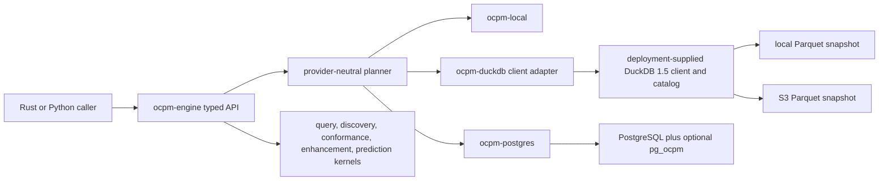

# DuckDB Parquet provider specification and delivery strategy

Status: 1.1.0 implementation and measured-delivery contract

Target: `ocpm-engine` 1.1.0

Compatibility baseline: `ocpm-engine` 1.0.0 and `pg_ocpm` 1.0.0
Last updated: 2026-08-03

## 1. Decision summary

Add a new `ocpm-duckdb` crate to `ocpm-engine`. The crate connects through a
dynamically linked, deployment-supplied DuckDB client and reads immutable
Parquet snapshots from either a local filesystem or an S3-compatible object
store. It does not embed DuckDB, create a database service, or depend on, call,
configure, or modify `pg_ocpm`.

The public entry point remains `ocpm-engine`. A caller chooses a data source,
but uses the same typed query, discovery, conformance, enhancement, prediction,
export, and explanation APIs regardless of provider.

The common aggregate and leading-execution paths do not load an entire
multi-million-event snapshot into a `CanonicalLog`. The provider pushes exact
work into DuckDB and uses the existing exact Rust kernel when an operation is
not yet pushable. That fallback is retained lazily by default for repeated
dynamic operations and is explicitly disableable when resident memory matters
more than repeated latency.

The first release is read-only with respect to the source Parquet snapshot.
The existing `Engine::append` semantics remain available through a
provider-neutral copy-on-write overlay. Persisting an overlay creates a new
immutable Parquet snapshot through an explicit export operation; it never
edits a published snapshot in place.

## 2. Why this belongs in `ocpm-engine`

DuckDB is an in-process analytical database, but `ocpm-engine` does not bundle,
compile, or own it. The provider dynamically links to a deployment-supplied
DuckDB client library and opens a caller-selected existing database file.
Parquet remains the portable storage format. This
fits the provider boundary already used for local memory and PostgreSQL:



`pg_ocpm` remains the PostgreSQL data-local acceleration layer. A DuckDB
provider is not a PostgreSQL extension and has no reason to route through
`pg_ocpm`. Sharing the engine contracts, canonical semantics, algorithms, and
provider tests is useful; sharing database-specific implementation is not.

This direction follows DuckDB's peer-reviewed embedded analytics architecture
instead of adapting another process-mining library implementation:

- Raasveldt and Muehleisen, "DuckDB: an Embeddable Analytical Database,"
  SIGMOD 2019, [doi:10.1145/3299869.3320212](https://doi.org/10.1145/3299869.3320212).
- The process-mining algorithms and semantics continue to use the sources in
  [the academic provenance ledger](academic-implementation-provenance.md).

No source code from another process-mining system is needed for this provider.
DuckDB integration uses its public APIs and published behavior.

## 3. Goals

1. Support local directories and S3-compatible prefixes containing Parquet.
2. Preserve every public `ocpm-engine` 1.0.0 function and request semantic.
3. Cover every `pg_ocpm` 1.0.0 process-mining use case through an exact
   DuckDB pushdown or a bounded engine fallback.
4. Keep source snapshots immutable and pin one consistent generation for the
   lifetime of every operation.
5. Push projections, filters, aggregation, traversal, ordering, and joins as
   close to Parquet as exact semantics allow.
6. Bound memory, temporary storage, parallelism, remote bytes, and cache size.
7. Support deterministic results for equal timestamps, repeated opens, local
   versus S3 execution, and different concurrency levels.
8. Generalize production-derived requirements including snapshot pointers,
   heterogeneous object links, non-temporal snapshot attributes, source-local
   timestamps, deleted-row publication rules, and selective remote lookup.
9. Preserve clean-room development. Process-mining behavior comes from the
   project's admitted peer-reviewed sources, not competitor source code.
10. Measure latency, concurrency, memory, storage, remote transfer, startup,
    and exactness separately.

## 4. Non-goals

- No change to the `pg_ocpm` repository or PostgreSQL extension.
- No direct SQL entry point for engine callers.
- No mutation of published Parquet files.
- No general data-lake catalog, ETL orchestrator, or object-store writer in the
  first provider release.
- No promise that remote Parquet is faster than a local or PostgreSQL provider
  for every query shape.
- No dataset names, fixed expected answers, activity names, or benchmark query
  identifiers in production planning code.
- No assumption that a manifest is correct merely because it exists.
- No interpretation of a latest-state object table as event-time history.

## 5. Compatibility contract

### 5.1 `ocpm-engine` 1.0.0 public capability parity

Every row in this table is a release gate. `Pushdown` means DuckDB executes the
operation over Parquet. `Kernel` means an existing source-neutral Rust kernel
consumes bounded DuckDB batches or sufficient statistics. `Overlay` means a
provider-neutral immutable base plus copy-on-write delta.

| 1.0.0 API or use case | DuckDB plan | Required result |
|---|---|---|
| `from_provider`, provider name, capabilities | Native provider registration | Same public facade and capability negotiation |
| Profile and source watermark | Pushdown over canonical views plus pinned snapshot metadata | Exact counts, types, activities, bounds, and generation |
| Canonical snapshot | Bounded canonical scans, materialized only on explicit request | Byte-equivalent canonical semantics or `ResourceLimit` before allocation |
| Canonical JSON and OCEL JSON import | Existing IO to local provider; optional later Parquet conversion | No regression |
| XES, CSV, and SQLite import | Existing IO to local provider; optional later Parquet conversion | No regression |
| Canonical JSON, OCEL JSON, XES, CSV, and SQLite export | Streaming export from bounded scans | Same output semantics and deterministic ordering |
| Incremental append and monotonic watermark | Copy-on-write overlay | Same validation and read-your-writes semantics without rewriting the base |
| `DatasetView` filters | Prepared DuckDB predicates where exact | Same half-open time range and null/absent behavior |
| Leading-object executions | Pushdown ordering and grouping, bounded batches | Same events, objects, multiplicity, and order |
| Connected-component executions | Pushdown relation scan plus bounded Rust union-find or recursive query | Same component membership and cycle behavior |
| Typed object-centric query AST | Pushdown exact subtrees; kernel composes residual tree | Same bindings, labels, violations, multiplicity, truncation, and order |
| Discovery: DFG, OC-DFG, Alpha, process tree, Petri net, OCPN, OC-DECLARE | Aggregate pushdown plus existing kernels | Same versioned model artifacts |
| Conformance: frequency, token replay, alignment, OCPN quality, OC-DECLARE, constraints | Pushdown features and executions plus existing kernels | Same exact/truncated status and bounded diagnostics |
| Enhancements: process map, timeline, histogram, performance, rework, organizational, window comparison, drift | Aggregate pushdown plus existing kernels | Same units, support, warnings, and group semantics |
| Fit prediction | Pushdown leakage-safe feature extraction plus existing trainer | Same seeded artifact contract |
| Predict next activity, remaining time, outcome, and risk | Pushdown features plus existing scorer | Same backoff, probability, interval, support, and lineage semantics |
| Temporal holdout evaluation | Multi-window pushdown plus existing evaluator | Same time ordering and no future leakage |
| Explain | Provider estimate plus physical operator evidence | Pushed predicates, fallback reason, bytes, rows, memory, and cache generation |

No existing engine method may silently switch to an unsupported approximation.
If a bounded exact plan is not available, the request fails with a typed error.

### 5.2 `pg_ocpm` 1.0.0 functional parity

The requirement is semantic use-case parity, not one-to-one duplication of
PostgreSQL administration. DuckDB does not need PostgreSQL tables, RLS, WAL,
extension installation, or SQL-callable capsule functions.

| `pg_ocpm` use-case family | DuckDB equivalent |
|---|---|
| Canonical event, object, E2O, O2O, and object-attribute history scans | Canonical Parquet views and bounded scan batches |
| Bounded event-log rows and factorized event batches | Ordered projected Parquet scan with batch cursors |
| Activity profiles and start/end membership | Grouped aggregate over ordered executions |
| DFG and lifecycle DFG counts | Directly-follows window plan with exact tie ordering |
| Variant and lifecycle variant counts | Ordered activity-path aggregate |
| Multi-window DFG and variant counts | One scan with a window-membership relation, chunked when needed |
| Duration statistics and time series | Exact aggregate plan with units and null policy |
| Edge features, process maps, rework, and multiplicity | Exact grouped aggregate plans |
| Candidate filtering by time, status, variant, activities, attributes, duration, and relationships | Typed predicate pushdown and residual evaluation |
| One-hop, closure, neighborhood, and selected-ID traversal | Qualified O2O/E2O joins or bounded recursive traversal |
| Object/activity/event binding cardinality | Binding aggregate plan |
| Required activity, eventually-follows, actor/attribute equality, and maximum delay | Binding predicate plan |
| Same-object and neighbor event pairs | Factorized pair batches, expanded only on request |
| Directed relation universal equality and child expansion | Factorized relation binding with explicit zero-membership children |
| Result cache keyed by filter and watermark | Optional generation-keyed result cache with byte limit |
| Estimate, explain, and capability negotiation | Provider V2 estimate and physical-plan diagnostics |
| Consistent generation publication and watermark | Immutable version pin plus validated pointer resolution |
| Tenant isolation | Mandatory source scope and cache-key scope; application/OS/S3 policy enforcement |

PostgreSQL-only lifecycle functions such as dataset registration, generation
publication, migration checkpoints, load-buffer compaction, and provider schema
DDL do not become DuckDB APIs. Their relevant guarantees map to source
validation, immutable versions, atomic local publication, conditional S3
pointer updates in a future writer, and versioned schema adapters.

## 6. Crate and feature layout

Add one database adapter crate and keep dependency direction inward:

```text
crates/
  ocpm-core/
  ocpm-provider/
  ocpm-local/
  ocpm-duckdb/          # new, optional database adapter
  ocpm-postgres/
  ocpm-query/
  ocpm-discovery/
  ocpm-conformance/
  ocpm-enhancement/
  ocpm-prediction/
  ocpm-engine/
  ocpm-python/
```

Rules:

- `ocpm-duckdb` depends on `ocpm-core` and `ocpm-provider`.
- Algorithm crates never depend on `ocpm-duckdb`.
- `ocpm-engine` adds `duckdb` and `duckdb-s3` features.
- `duckdb` dynamically links to a deployment-supplied, version-compatible
  DuckDB client library. It never enables `duckdb-rs` bundled compilation.
- `database.kind = "existing"` requires a pre-existing catalog file and never
  creates one implicitly, including in read-write mode.
- `duckdb-s3` adds only the trusted S3 extension bootstrap and credential
  configuration.
- `postgres` and `duckdb` may be compiled together. Runtime selection remains
  per engine instance.
- The exact `duckdb-rs` API line and minimum DuckDB client version are pinned
  together. The deployment image installs the official checksum-verified
  shared client separately and records it in the SBOM. A caller may supply the
  compatible library through the standard dynamic-linker path.

## 7. Public source contract

Add an engine-owned source type. Provider-specific handles remain private.

```rust
pub enum DataSource {
    InMemory(CanonicalLog),
    OcelFile { uri: String, format: OcelFormat },
    XesFile { uri: String },
    Csv { uri: String, mapping: CsvMapping },
    Sqlite { path: PathBuf },
    Postgres(PostgresSource),
    DuckDbParquet(DuckDbParquetSource),
}

pub struct DuckDbParquetSource {
    pub database: DuckDbDatabase,
    pub location: ParquetLocation,
    pub snapshot: SnapshotSelection,
    pub layout: ParquetLayout,
    pub cache: ParquetCachePolicy,
    pub credentials: Option<S3CredentialReference>,
    pub validation: SourceValidationPolicy,
    pub options: DuckDbOptions,
}

pub enum DuckDbDatabase {
    Existing { path: PathBuf, read_only: bool },
}

pub enum ParquetLocation {
    Local { root: PathBuf },
    S3 {
        uri: S3Uri,
        region: Option<String>,
        endpoint: Option<String>,
        url_style: Option<S3UrlStyle>,
        use_ssl: Option<bool>,
    },
}

pub struct DuckDbOptions {
    pub memory_budget_bytes: u64,
    pub max_parallelism: usize,
    pub connection_pool_size: usize,
    pub max_temp_bytes: u64,
    pub temp_directory: Option<PathBuf>,
    pub result_cache_bytes: u64,
    pub cache_canonical_fallback: bool,
    pub materialize_execution_relation: bool,
    pub extension_policy: ExtensionPolicy,
}

pub enum SnapshotSelection {
    Current { pointer: RelativePath },
    Fixed { version: SnapshotVersion },
}

pub enum ParquetLayout {
    CanonicalV1,
    MappedV1(ParquetMappingV1),
    Preset(ParquetLayoutPreset),
}
```

`Engine::open(source, options)` validates and pins the source. Existing
constructors stay supported. Convenience constructors may call `open`, but no
second semantic API is introduced.

The public API accepts structured URIs, identifiers, predicates, and mappings.
It never accepts arbitrary SQL fragments.

## 8. Provider contract upgrade

The current 1.0 provider returns complete `Vec<ProcessExecution>` values and
can expose a complete `CanonicalLog`. That boundary is acceptable for small
local logs but defeats remote Parquet pruning and can exhaust memory.

Introduce an additive `OcpmProviderV2` contract while retaining the 1.0 trait
through adapters:

```rust
pub trait BatchCursor<T>: Send {
    fn next_batch(&mut self) -> OcpmResult<Option<T>>;
    fn cancel(&self);
}

pub trait OcpmProviderV2: Send + Sync {
    fn descriptor(&self) -> ProviderDescriptor;
    fn profile(&self, view: &DatasetView) -> OcpmResult<DatasetProfile>;
    fn scan_events(&self, plan: &EventScan)
        -> OcpmResult<Box<dyn BatchCursor<EventBatch>>>;
    fn scan_objects(&self, plan: &ObjectScan)
        -> OcpmResult<Box<dyn BatchCursor<ObjectBatch>>>;
    fn scan_e2o(&self, plan: &RelationScan)
        -> OcpmResult<Box<dyn BatchCursor<E2oBatch>>>;
    fn scan_o2o(&self, plan: &RelationScan)
        -> OcpmResult<Box<dyn BatchCursor<O2oBatch>>>;
    fn scan_object_attribute_history(&self, plan: &AttributeHistoryScan)
        -> OcpmResult<Box<dyn BatchCursor<ObjectAttributeBatch>>>;
    fn process_executions(&self, plan: &ProcessExecutionPlan)
        -> OcpmResult<Box<dyn BatchCursor<ProcessExecutionBatch>>>;
    fn aggregate(&self, plan: &AggregatePlan)
        -> OcpmResult<Box<dyn BatchCursor<AggregateBatch>>>;
    fn evaluate_bindings(&self, plan: &BindingPlan)
        -> OcpmResult<Box<dyn BatchCursor<BindingBatch>>>;
    fn traverse(&self, plan: &TraversalPlan)
        -> OcpmResult<Box<dyn BatchCursor<TraversalBatch>>>;
    fn estimate(&self, plan: &LogicalPlan) -> OcpmResult<ProviderEstimate>;
    fn explain(&self, plan: &LogicalPlan) -> OcpmResult<ProviderExplain>;
}
```

Contract rules:

- Default target batch size is 8 MiB; a batch may not exceed 16 MiB.
- Batches preserve canonical IDs, qualifiers, multiplicity, source order keys,
  and null versus absent semantics.
- Capabilities describe exact semantic versions, limits, and supported
  operators, not only boolean flags.
- A provider may reject a pushdown before execution. It may not partially
  execute and then return an incomplete domain result.
- Every cursor receives a deadline and cancellation token.
- The V1 adapter collects only when the caller explicitly uses a V1 method and
  the configured memory budget permits it.
- `ocpm-local` and `ocpm-postgres` gain V2 adapters so the contract tests run
  identically across all providers.

This upgrade benefits every large provider. It is not DuckDB-only machinery.

## 9. Canonical Parquet layout

### 9.1 `CanonicalV1`

A canonical snapshot directory contains:

```text
manifest.json
events/*.parquet
objects/*.parquet
event_object_relations/*.parquet
object_object_relations/*.parquet
object_attribute_history/*.parquet       # optional
acceleration/*.parquet                   # optional and non-authoritative
```

The manifest includes:

- layout and canonical semantic versions;
- immutable snapshot version and source watermark;
- file paths, sizes, hashes, schemas, and row counts;
- source timestamp policy;
- partition and sort keys;
- producer identity and version;
- optional acceleration-artifact certificates; and
- a manifest content hash.

Canonical tables retain the fields defined by `ocpm-core`. Event order is the
tuple `(timestamp_utc, sequence, event_id)`. E2O and O2O qualifiers are not
dropped. Object attribute changes carry effective timestamps and provenance.

### 9.2 `MappedV1`

Existing Parquet corpora rarely use canonical column names. A closed mapping
schema describes file patterns, source columns, typed casts, JSON paths,
normalization, stable IDs, order keys, relation direction, and attribute
validity. The mapping is data, not executable SQL.

All identifiers and JSON paths are parsed and validated before SQL is
generated. Values are bound parameters. SQL templates are fixed in the crate.

### 9.3 General preset for an entity-link snapshot

Ship a public, vendor-neutral preset for corpora with these logical inputs:

- an event table containing object ID, object type, activity, timestamp, and a
  JSON payload with a stable event ID;
- an object snapshot table with current facets;
- an object-link table with source and target IDs, types, and timestamps;
- an optional directly-follows edge table; and
- an optional case/event rank table.

The preset is named `EntityLinkSnapshotV1`. It is configured with file names
and column mappings, so the implementation contains no customer, tenant,
bucket, workspace, activity, or dataset identifiers.

## 10. Generalized corpus requirements

The following requirements are derived from a representative production
snapshot class with millions of events, about a million objects, many object
types, explicit object links, immutable versions, and both local and remote
Parquet access. They are intentionally expressed as public data contracts.

### 10.1 Stable event identity

A stable event ID may live in a typed column or a configured JSON path. The
provider validates that it is present and unique before enabling binding,
multi-object, or acceleration paths. A row number is never used as durable
event identity.

If the same logical event is repeated once per related object, the mapper
deduplicates the event and emits multiple E2O relations. If each row represents
a distinct event, it must have a distinct stable event ID. The mapping declares
which interpretation applies.

### 10.2 Deterministic equal-time order

Source timestamps may be equal within one execution. A configured source rank
maps to `Event.sequence`; stable event ID is the final tie breaker. The provider
fails validation if the configured tuple cannot produce a deterministic order.

For standard OCEL 2.0 relational SQLite import, the base `event` table's
SQLite row order is preserved as `Event.sequence`. Typed activity tables may
have a different physical order and therefore cannot supply this tie-break.
The external event ID remains the final deterministic key.

Derived DFG, variants, eventually-follows, prediction prefixes, and temporal
conformance all use the same order contract.

### 10.3 Source-local timestamps

A timestamp without an offset is not assumed to be UTC. The source requires an
IANA time-zone name or an explicit fixed-offset policy. Conversion preserves
the source lexical timestamp.

Ambiguous or nonexistent daylight-saving timestamps fail closed by default.
An explicit mapping may select `earliest`, `latest`, or a documented shift
policy. The selected policy becomes part of the source hash and result
provenance.

### 10.4 Attribute validity and leakage prevention

Add an additive attribute-validity descriptor:

```rust
pub enum AttributeValidity {
    EventTime,
    EffectiveFrom { timestamp_column: String },
    SnapshotObserved { snapshot: SnapshotVersion },
    CollectedAt { timestamp_column: String },
    Unknown,
}
```

Snapshot-observed, collected-at, and unknown object attributes may be used for
current-state filtering and descriptive facets. They are excluded by default
from historical conformance, drift, training, and prediction features because
they do not prove what was known at the event time. A caller may opt in only
through a typed policy that is recorded in diagnostics.

Process state encoded by event activity remains distinct from a current-state
object facet with a similar label. The mapper does not merge them.

### 10.5 Published versus raw rows

A layout names authoritative published relations. Raw ingestion, tombstoned,
or deleted-source rows are excluded unless a separate ingestion source is
explicitly opened. A recursive glob under the snapshot root is forbidden.

### 10.6 Manifest distrust

`Strict` validation recomputes file schema, row counts, minimum and maximum
timestamps, ID uniqueness, referential integrity, and hashes where configured.
`Balanced` validates schema, snapshot identity, file metadata, sampled
relations, and claimed counts. `Fast` may trust a signed manifest but records
that choice. Public benchmarks and release tests use `Strict`.

### 10.7 Optional derived relations

Precomputed directly-follows edges, case ranks, activity groups, or other
accelerators are not canonical truth. The provider may use one only when its
certificate includes:

- canonical input hashes;
- derivation semantic and implementation versions;
- ordering, window, lifecycle, null, and qualifier policies;
- exact row/count hashes for a validation fixture; and
- the immutable source snapshot version.

If validation fails or the certificate is absent, the provider derives the
result from canonical relations.

### 10.8 Boolean and status normalization

Mappings may normalize legacy tokens such as `Y`, `N`, empty, and null into a
typed value. Null and false remain distinct unless the mapping explicitly says
otherwise. Normalization rules participate in the source hash.

## 11. Snapshot and consistency model

### 11.1 Immutable versions

A source root may contain a small pointer file and immutable version
directories:

```text
<root>/CURRENT
<root>/versions/<version>/manifest.json
<root>/versions/<version>/*.parquet
```

On each `open(Current)` or explicit `refresh`, the provider:

1. reads the pointer without a process-global TTL;
2. validates its length, character set, and relative-path form;
3. resolves it under the configured root;
4. reads and validates the version manifest;
5. records object metadata and hashes; and
6. pins that version for the provider lifetime.

One operation never mixes files from different versions. A pointer change is
visible only to a newly opened or refreshed engine. `Fixed(version)` bypasses
the pointer and is required for reproducible benchmarks.

For S3, the provider enables HTTP metadata caching only with object-version
pinning or equivalent ETag/version checks. With a DuckDB release that supports
it, the provider sets `s3_version_id_pinning = true` when
`enable_http_metadata_cache = true`; otherwise it disables that cache and
performs explicit version/ETag validation. This defends against a mutable object
being overwritten during a read. Source writers are expected to publish new
immutable keys and change only the small pointer.

### 11.2 Refresh

`Engine::refresh()` creates and validates a new provider generation, then
atomically returns a new engine handle. Existing handles continue reading the
old generation. Cache keys include the resolved snapshot and cannot collide
across refreshes.

## 12. Local and S3 execution modes

```rust
pub enum ParquetCachePolicy {
    Direct,
}
```

### 12.1 Direct

DuckDB scans the pinned local or S3 Parquet objects. The 1.1.0 release provides
only this source-storage policy: it creates no hidden mirror database and does
not duplicate Parquet. Repeated exact aggregate results may use a separate
generation-scoped, byte-bounded in-process LRU. It is enabled by
`result_cache_bytes` and can be set to zero.

DuckDB's Parquet reader provides projection and filter pushdown and can skip
row groups using Parquet statistics. These benefits depend on file layout and
statistics, so the provider verifies the physical plan rather than assuming a
filter was pruned.

When `materialize_execution_relation` is true, each connection builds one
temporary relation containing the event/object join, stable lifecycle order,
and full-lifecycle bounds. It remains connection-local, is governed by the
DuckDB memory and spill limits, and disappears when the connection closes. It
does not mutate the caller's catalog or Parquet. Benchmarks report connection
open time and process memory so this startup-versus-query tradeoff is explicit.

Persistent mirroring and physical Parquet rewrites are intentionally not public
1.1.0 options. Shipping an accepted configuration value that is unimplemented,
or silently creating another DuckDB catalog, would violate the existing-instance
boundary. A future release may add explicit caller-managed cache catalogs after
their build cost, invalidation, storage budget, and exactness are independently
specified and benchmarked.

## 13. Query planning and exact fallbacks

The engine compiles `QueryRequest` and the other closed typed request contracts
into logical plans. The DuckDB provider compiles supported operators into fixed
SQL templates and prepared values.

Pushdown candidates include:

- file, column, row-group, time, activity, type, ID, qualifier, and typed
  attribute filtering;
- event/object/E2O/O2O projection;
- stable temporal ordering;
- grouped counts and sufficient statistics;
- DFG, variant, start/end, rework, duration, feature, process-map, and window
  aggregates;
- leading-object grouping;
- one-hop and bounded recursive traversal;
- exact binding joins and child counts; and
- leakage-safe prediction feature windows.

Fallback rules:

1. Push only a subtree whose semantics are exact for the pinned provider
   semantic version.
2. Return bounded canonical or sufficient-statistic batches at the boundary.
3. Evaluate the residual subtree in the existing Rust kernel.
4. Preserve labels, multiplicity, witnesses, deterministic order, and result
   limits after recomposition.
5. Reject a plan before execution if estimated memory, spill, cache, deadline,
   or output limits cannot be honored.

No result is approximate unless the public request explicitly selects a
versioned approximate algorithm and the result reports its error contract.

## 14. Concurrency and resource model

- One provider connects to one caller-selected DuckDB database/catalog through
  a bounded pool of connections. Connections are never concurrently used by
  multiple threads. Catalog views are temporary and do not mutate an existing
  database file.
- Read queries use pinned immutable Parquet relations. Source writes are not
  performed through query connections.
- DuckDB `threads` is bounded by `EngineOptions.max_parallelism`. Admission
  control accounts for both request concurrency and DuckDB worker threads to
  prevent oversubscription.
- `memory_limit`, `max_temp_directory_size`, and the temp directory are set
  from engine options before configuration is locked.
- Engine memory accounting includes batch buffers, decoded strings, result
  materialization, overlay state, and cache metadata. DuckDB-reported memory,
  process RSS, spill bytes, and remote bytes are recorded separately.
- A failed query releases its connection and intermediate buffers. A future
  provider-contract revision will add deadline/cancellation tokens and DuckDB
  interruption; 1.1.0 does not advertise a cancellation API.
- The aggregate result cache is byte-bounded, generation-scoped, disableable,
  and least-recently-used.

DuckDB supports concurrent work inside one process using multiple connections,
and multiple processes may open the same existing database read-only. The
provider does not invent a network server protocol that DuckDB does not expose;
deployment supplies the client library and database-file lifecycle.

## 15. Append and export

The 1.0 `Engine::append` contract remains exact: it obtains a complete snapshot
and returns a new local provider. This can materialize the source and is
reported as a fallback. A future general `OverlayProvider` could avoid that
copy:

```text
pinned immutable base provider
             +
bounded validated append segments
             =
new logical engine generation
```

Such an overlay would:

- validates all canonical columns and references;
- enforces a monotonic source watermark;
- gives the new engine read-your-writes behavior;
- merges base and delta scans in canonical order;
- invalidates affected aggregate cache entries;
- spills only to the configured engine directory; and
- remains usable with local, DuckDB, and PostgreSQL base providers.

An explicit `write_parquet_snapshot(destination, options)` streams a complete
new canonical snapshot into a staging version, validates it, and publishes it
atomically for local destinations. S3 publication is a later opt-in writer
capability that requires conditional pointer updates and a separate write
credential. The read provider never receives write credentials.

## 16. Security model

DuckDB SQL executes with the host process's privileges, so the provider treats
SQL and paths as security boundaries.

Requirements:

- No arbitrary SQL in Rust, Python, JSON, mapping, or adapter-facing APIs.
- Only fixed compiler-owned SQL templates. All data values use prepared
  parameters. Identifiers come from validated schema mappings and are quoted by
  one audited utility.
- Local paths resolve under configured dataset, cache, and temp roots. Reject
  traversal, symlink escape, device files, and implicit recursive globs.
- S3 URIs are parsed structurally and restricted to configured bucket/prefix
  scopes.
- Credentials are references to an AWS SDK credential chain, named profile,
  role, region, or endpoint. Raw secret keys are never accepted in normal
  requests, serialized, logged, cached, or returned by `explain()`.
- Prefer temporary scoped credentials. The read provider does not need S3
  write permission.
- Load only the required DuckDB core-signed `httpfs` and `aws` extensions for
  S3. Disable community and unsigned extensions and automatic
  installation/loading after explicit bootstrap. Lock configuration before
  opening untrusted data.
- Package or preinstall extension binaries for every supported DuckDB version
  and platform. Do not silently download executable code during a service
  request. DuckDB extension binaries are version- and platform-specific.
- Set allowed paths/directories and resource limits. Keep unredacted secret
  inspection disabled.
- Validate decompressed sizes, row counts, string/blob sizes, JSON depth,
  expression depth, file count, and mapping size before or during scans.
- Redact filesystem roots, bucket names, object keys, credentials, and source
  attribute values from default diagnostics.

## 17. Python API and packaging

The Python package continues to expose one engine facade. Add typed constructor
helpers without a SQL escape hatch:

```python
engine = StandaloneEngine.from_duckdb_parquet(
    {
        "database": {
            "kind": "existing",
            "path": "/catalog/analytics.duckdb",
            "read_only": True,
        },
        "location": {"kind": "local", "root": "/data/snapshot"},
        "snapshot": {"kind": "current", "pointer": "CURRENT"},
        "layout": {"kind": "canonical_v1"},
        "cache": {"kind": "direct"},
        "options": {
            "memory_budget_bytes": 536_870_912,
            "max_parallelism": 8,
            "result_cache_bytes": 67108864,
        },
    }
)
```

An S3 constructor accepts a credential reference, not credential values.
Blocking DuckDB work releases the Python GIL. Exceptions map to stable engine
error codes and do not leak DuckDB SQL or secrets by default.

Standard wheels must not include a bundled DuckDB. They declare the compatible
DuckDB client ABI and fail at load time with an actionable dependency error if
the deployment has not supplied it. Docker images install the official,
checksum-pinned shared client as a separate layer. Images advertising S3
support preinstall the exact trusted extensions or use an explicitly enabled,
audited install policy. Rust consumers may disable DuckDB features. A Python
wheel must not silently fall back to compiling DuckDB.

The Docker benchmark provisions its otherwise-empty catalog directly through
that deployment client's public C API before opening `ocpm-engine` read-only.
Catalog provisioning is outside request latency and outside the product API.

## 18. Observability and provenance

Every operation records bounded diagnostics:

- provider, provider semantic version, DuckDB version, and extension versions;
- source layout, mapping hash, immutable snapshot, manifest hash, and cache
  generation;
- validation level and warnings;
- logical and physical operator names;
- pushed and residual predicates;
- estimated and actual input/output rows and bytes;
- remote requests/bytes, local bytes, and result-cache hit/miss;
- DuckDB elapsed time, engine kernel time, result materialization time, and
  total latency;
- worker count, peak tracked engine memory, DuckDB memory, RSS, spill bytes,
  and cache footprint;
- cancellation, timeout, truncation, and approximation state; and
- canonical result hash.

Raw SQL, secrets, customer identifiers, source roots, and attribute values are
excluded from default diagnostics.

## 19. Test strategy

### 19.1 Provider contract tests

Run one request corpus against `ocpm-local`, `ocpm-duckdb` local,
`ocpm-duckdb` S3, and `ocpm-postgres` where equivalent data exists. Compare
canonical results after removing execution diagnostics.

Cover:

- empty, single-row, and multi-million-row inputs;
- one event linked to multiple objects;
- repeated event rows requiring deduplication;
- equal timestamps with and without a valid source rank;
- cycles, self-links, duplicate links, direction, qualifiers, and zero-child
  relation bindings;
- null, absent, empty, legacy boolean tokens, large strings, and nested JSON;
- current-state, collected-at, unknown, and effective-time attributes;
- local timestamps, offset timestamps, DST ambiguity, and DST gaps;
- time, activity, object, relationship, status, duration, and attribute
  filters in nested boolean trees;
- leading-object and connected-component executions;
- all discovery, conformance, enhancement, and prediction enum variants;
- snapshot pointer rollover during active reads;
- missing, malformed, stale, and dishonest manifests;
- missing Parquet files, schema drift, corrupt row groups, broken E2O/O2O
  references, and duplicate IDs;
- cancellation, timeout, memory exhaustion, spill exhaustion, and result-cache
  eviction; and
- concurrent reads, refreshes, and result-cache fills.

### 19.2 Differential and property tests

- Result hashes match across providers for every exact operator.
- Pushdown plus residual evaluation equals full kernel evaluation.
- Boolean query rewrites preserve bindings and multiplicity.
- Local and S3 Direct return identical results.
- Random valid layouts map to the same canonical data as their generated JSON
  counterpart.
- Snapshot refresh never mixes two versions.
- Future or untrusted snapshot attributes never enter default training
  features.
- Physical plan changes never change domain results.

### 19.3 Security tests

- SQL metacharacters in values, identifiers, JSON paths, filenames, and object
  keys cannot alter a template.
- Path traversal, symlink escape, unauthorized bucket/prefix access, recursive
  raw-data discovery, and S3 writes fail closed.
- Community, unsigned, mismatched-version, and wrong-platform extensions fail
  closed.
- Secrets do not appear in logs, errors, provenance, serialized engine state,
  or benchmark artifacts.
- Resource limits and cancellation remain effective for adversarial queries.

## 20. Benchmark strategy

Benchmarks use pinned Docker images, immutable snapshot hashes, fixed requests,
randomized run order, warmups, raw samples, exact-answer gates, and clean
committed source revisions.

### 20.1 Arms

1. `ocpm-local` over the same canonical data when it fits the memory budget.
2. `ocpm-duckdb` over local Parquet.
3. `ocpm-duckdb` over S3 Direct, cold and warm metadata state.
4. `ocpm-duckdb` with the exact-result cache disabled and enabled, reported as
   separate latency states.
5. `ocpm-postgres` with `pg_ocpm` 1.0.0 where the same canonical data can be
   loaded exactly.

The DuckDB module is not compared to a different semantic workload. Cells
without equivalent semantics are `N/A`.

### 20.2 Workloads

- open, validate, and profile;
- activity and start/end frequency;
- selective event, case, and object lookup;
- dynamic combinations of time, type, activity, status, attribute, duration,
  and relationship filters;
- leading-object and connected-component execution extraction;
- DFG, OC-DFG, variants, rework, duration, process maps, time series, and
  multi-window drift statistics;
- one-hop, closure, and directed relationship traversal;
- binding cardinality, eventually-follows, temporal delay, neighbor equality,
  pair extraction, universal relation, and child expansion;
- discovery and conformance workloads that consume event detail;
- next-activity, remaining-time, and outcome feature extraction, fitting,
  scoring, and temporal evaluation; and
- streaming export.

Use at least three data families:

- the sanitized production-derived entity-link snapshot shape;
- public OCEL data with genuine many-to-many E2O and qualified O2O relations;
  and
- generated adversarial data with skew, equal timestamps, cycles, sparse
  attributes, wide payloads, and multiple immutable versions.

### 20.3 Metrics

- open/validation and first-query latency;
- warm p50, p95, and p99 latency;
- throughput and tail latency at 1, 2, 4, 8, and 16 clients;
- cancellation latency;
- process RSS, peak tracked engine memory, DuckDB memory, and spill;
- source, result-cache memory, catalog, and temporary storage footprint;
- bytes read locally, bytes transferred from S3, and request count;
- snapshot conversion latency and storage amplification;
- output rows/bytes and materialization latency; and
- exact canonical answer and model hashes.

### 20.4 Release gates

1. All supported result cells match the canonical oracle exactly.
2. Every `ocpm-engine` 1.0.0 API family has a passing DuckDB provider test.
3. Every process-mining use-case family accelerated by `pg_ocpm` has an exact
   DuckDB pushdown or bounded fallback test.
4. No default operation requires whole-source hydration.
5. Peak tracked engine allocations remain within the configured budget plus
   10 percent allocator tolerance. DuckDB memory and total RSS are reported
   separately and must have explicit budgets.
6. S3 Direct reports actual remote requests and bytes. Persistent caches may
   not be hidden in a cold result.
7. Result-cache-enabled and result-cache-disabled latency are reported
   separately; cache retention is included in process memory.
8. Throughput is nondecreasing until the declared CPU, memory, disk, or network
   saturation point. Oversubscription regressions block release.
9. Dynamic and adversarial workloads show no planner dependency on dataset
   names, activity labels, request IDs, or expected answers.
10. Existing local and PostgreSQL provider correctness tests remain green, and
    their median latency does not regress by more than 5 percent unless the
    release report explains and approves the tradeoff.

The release report describes measured tradeoffs. It does not require DuckDB to
beat PostgreSQL for every query, and it does not generalize one fixed-query
ratio to unseen workloads.

## 21. Delivery plan

Implementation was delivered in staged phases from contract freeze through
release; the staged plan is maintained internally.

## 22. Expected file changes

The per-file change inventory for this provider is maintained internally.

## 23. Rollout and rollback

- All DuckDB code is behind optional Cargo features.
- Existing constructors and providers remain the default behavior.
- The provider performs no source mutation, so disabling the feature is an
  immediate rollback.
- Result caches are disposable, memory-only, and scoped to a pinned source
  generation; disabling or dropping the engine loses no source data.
- Provider V2 is additive. V1 adapters remain for the 1.x compatibility
  window.
- A release may ship local support before S3 only if the S3 constructor and
  capability are absent, not present but nonfunctional.

## 24. Definition of done

The DuckDB module is done when:

- `ocpm-engine` opens canonical and mapped Parquet locally and through S3;
- one operation observes one validated immutable snapshot;
- every current engine function and enum variant has an exact DuckDB test;
- every current PostgreSQL acceleration use-case family has an exact pushdown
  or bounded fallback test;
- multi-object events, qualified links, equal timestamps, source-local time,
  current-state attributes, deleted-row publication rules, and selective
  remote queries behave according to this spec;
- no default large-data operation hydrates the full log;
- latency, concurrency, storage, memory, remote transfer, and correctness
  evidence passes the Docker release gates;
- the source and planner contain no customer, dataset, activity, benchmark, or
  expected-answer special cases;
- the public API exposes no raw SQL or raw credentials;
- existing local and PostgreSQL providers remain compatible; and
- release documentation clearly distinguishes source storage, optional cache,
  build cost, warm query performance, and total process memory.

## 25. Version 1.0.0 coverage manifest

This manifest is the minimum source audit for the release. A generated golden file
will record the same public methods, enum variants, provider capabilities, and
extension function families. CI fails when the 1.x surface changes without a
new DuckDB classification and contract test.

### 25.1 Engine facade methods

The DuckDB work must preserve these current `Engine` methods:

- construction: `from_provider`, `from_log`, `from_canonical_json`,
  `from_ocel2_json`, `from_csv`, `from_xes`, `from_sqlite`, and the
  PostgreSQL-specific `from_postgres_snapshot`;
- provider and data operations: `provider_name`, `capabilities`, `profile`,
  `snapshot`, and `append`;
- export: `write_canonical_json`, `write_ocel2_json`, `write_csv`, `write_xes`,
  and `write_sqlite`;
- mining: `query`, `discover`, `conformance`, `enhance`, `fit_prediction`,
  `predict`, and `evaluate_prediction`; and
- planning: `explain`.

`from_postgres_snapshot` remains PostgreSQL-specific. DuckDB adds an equivalent
source constructor through `Engine::open`; it does not rename or weaken the
PostgreSQL constructor.

### 25.2 Typed request variants

The coverage test includes every current variant:

- query constraints: `EventId`, `ObjectId`, `EventActivity`,
  `EventAttributeEquals`, `ObjectAttributeEquals`, `ObjectType`,
  `E2oQualifier`, `O2oQualifier`, `DirectlyFollows`, `EventuallyFollows`,
  `TemporalDistance`, `Relationship`, `ChildCount`, `And`, `Or`, `Not`, and
  `Label`;
- discovery: `Dfg`, `OcDfg`, `Alpha`, `InductiveProcessTree`, `PetriNet`,
  `ObjectCentricPetriNet`, and `OcDeclare`;
- conformance: `FrequencyCoverage`, `TokenReplay`, `Alignment`, `OcpnQuality`,
  `OcDeclare`, and `Constraints`;
- enhancement: `ProcessMap`, `Timeline`, `Histogram`, `Performance`, `Rework`,
  `Organizational`, `WindowComparison`, and `Drift`;
- prediction: `NextActivity`, `RemainingTime`, `Outcome`, and `Risk`; and
- provider capabilities: `CanonicalScan`, `ProcessExecutions`,
  `ObjectCentricQuery`, `DfgAggregate`, `VariantAggregate`,
  `PerformanceAggregate`, and `PredictionFeatures`.

### 25.3 PostgreSQL extension function families

All `pg_ocpm` 1.0.0 function names are classified below. Overloaded functions
share one name in this manifest.

| Classification | Current functions | DuckDB obligation |
|---|---|---|
| Provider protocol | `_assert_provider_request`, `provider_capabilities`, `estimate`, `explain_provider`, `event_batches`, `object_batches`, `e2o_batches`, `o2o_batches`, `process_execution_batches`, `aggregate_batches`, `binding_batches` | V2 validation, descriptor, estimate, explain, and bounded cursors |
| Event export | `event_log_rows`, `event_log_batches`, `event_log_window_batches` | Ordered projected scan and factorized execution batches |
| Activity, DFG, and variants | `activity_multiplicities`, `activity_boundary_memberships`, `activity_path_edges`, `activity_profile`, `dfg_counts`, `dfg_window_counts`, `lifecycle_dfg_window_counts`, `variant_counts`, `variant_window_counts`, `lifecycle_variant_window_counts` | Exact single- and multi-window aggregates |
| Cases and traversal | `case_candidates`, `case_window`, `connected_objects`, `connected_objects_one_hop`, `connected_objects_closure`, `adjacency_links`, `adjacency_neighborhood`, `adjacency_selected_id_rows`, `adjacency_selected_ids` | Typed filters, execution windows, and bounded qualified traversal |
| Performance and time series | `duration_stats_window_value`, `edge_duration_stats`, `edge_duration_time_series`, `edge_feature_aggregates`, `rework_counts`, `window_count`, `window_cardinality`, `segment_window_count`, `segment_window_cardinality` | Exact grouped statistics, units, support, null policy, and windows |
| Binding evaluation | `binding_object_activity_count`, `binding_requires_activity`, `binding_event_object_count`, `binding_neighbor_eventually`, `binding_neighbor_actor_equal`, `binding_neighbor_attribute_equal`, `binding_max_activity_delay`, `binding_neighbor_pairs`, `binding_ids`, `binding_same_object_event_pairs`, `binding_neighbor_event_pairs`, `binding_relation_universal_equal`, `binding_relation_children`, `binding_capsule_rows` | Exact factorized binding plans with duplicate and zero-child semantics |
| Cache | `cache_get`, `cache_put` | Optional immutable-generation result cache with canonical filter keys |
| Dataset and generation administration | `register_dataset`, `dataset_id`, `begin_generation`, `validate_generation`, `publish_generation`, `fail_generation`, `migrate_dataset_to_v1`, `publish_migrated_dataset`, `clear_dataset`, `finish_load`, `rebuild_binding_index` | No SQL clone; map guarantees to open, validate, immutable pin, refresh, append, and export |
| Tenant enforcement | `current_tenant_id`, `_assert_tenant` | Mandatory source scope, cache scope, credential scope, and deployment isolation |
| Version | `version` | Provider descriptor reports crate, semantic, DuckDB, layout, and extension versions |
| Physical encoding and aggregate support | `adjacency_encode`, `binding_relation_pack`, `timestamp_encode`, `timestamp_decode`, `duration_stats_transfn`, `duration_stats_finalfn`, `duration_stats_window_transfn`, `edge_duration_series_transfn`, `edge_duration_series_finalfn`, `feature_stats_transfn`, `feature_stats_finalfn`, `int8_vector_sum_transfn`, `int8_vector_sum_finalfn`, `process_map_transfn`, `process_map_finalfn`, `time_series_transfn`, `time_series_finalfn`, `transition_multiplicity_transfn`, `transition_multiplicity_finalfn`, `window_cardinalities_transfn`, `window_cardinalities_finalfn` | No binary-format compatibility requirement; DuckDB must return the same public semantic results through its native vectorized plan |

The final row is deliberately not a request to port PostgreSQL C aggregate
states or capsule encodings. Those are physical implementations. Compatibility
is measured at the provider and engine result boundary.

## 26. Primary implementation references

- [DuckDB embedded database paper](https://duckdb.org/library/duckdb/)
- [DuckDB Parquet projection and filter pushdown](https://duckdb.org/docs/stable/data/parquet/overview)
- [DuckDB Parquet row-group and sorting guidance](https://duckdb.org/docs/stable/data/parquet/tips)
- [DuckDB S3 API and credential chains](https://duckdb.org/docs/current/core_extensions/httpfs/s3api)
- [DuckDB concurrency model](https://duckdb.org/docs/current/connect/concurrency)
- [DuckDB security guidance](https://duckdb.org/docs/current/operations_manual/securing_duckdb/overview)
- [DuckDB extension security](https://duckdb.org/docs/current/operations_manual/securing_duckdb/securing_extensions)
- [DuckDB extension distribution and binary compatibility](https://duckdb.org/docs/current/extensions/extension_distribution)
- [DuckDB interruption and progress APIs](https://duckdb.org/docs/current/clients/c/connect)
- [`duckdb-rs` version and dynamic client linkage](https://docs.rs/crate/duckdb/latest)
