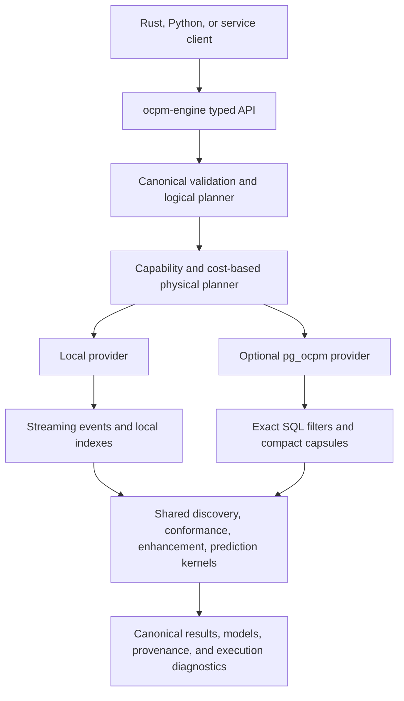

# ocpm-engine 1.0.0 product and engineering specification

Status: proposed implementation contract  
Owner: ocpm-engine maintainers  
Target release: 1.0.0  
Snapshot date: 2026-08-03

## 1. Decision

`ocpm-engine` 1.0.0 is a standalone, source-neutral Rust process-mining engine.
It must work against files or in-memory data without PostgreSQL. When a
compatible `pg_ocpm` provider is configured, the same public operations must
transparently push selective scans, relationship traversal, and sufficient
statistics into PostgreSQL.

The engine is the primary public entry point. Applications, Python clients, and
external adapters call the engine, never extension-specific SQL.
Provider choice can change the physical plan, latency, memory, and transfer
volume, but not result semantics.

This replaces the 0.10 architecture in which `OcpmEngine` requires an installed
`pg_ocpm` instance and exposes PostgreSQL capability details in its public
Python API. It preserves the useful 0.10 native kernels and database pushdown,
but makes them implementations of a complete provider contract.

## 2. Product objective

Provide one embeddable OCPM runtime that covers the common operational use
cases documented by OCPQ, Rust4PM, and OCPA:

- lossless OCEL and conventional event-log access;
- object-centric filtering, relationship queries, and process executions;
- descriptive discovery and model discovery;
- conformance checking;
- performance enhancement and drift monitoring;
- next-activity, remaining-time, and outcome/risk prediction; and
- stable model/result serialization for applications and LLM tools.

Version 1.0.0 is complete only when every mandatory capability has a local
implementation. `pg_ocpm` is an accelerator, not a feature gate.

## 3. Why this architecture is differentiated

The differentiation is not Rust alone, SQL alone, or any single mining
algorithm. Those all have prior art. The product contribution is the following
combination:

1. one source-neutral logical OCPM plan and result model;
2. equivalent local and PostgreSQL-backed physical providers;
3. cost- and capability-aware partitioning of a query between exact
   data-proximate reduction and stateless Rust algorithms;
4. compact sufficient-statistic and factorized relationship exchanges instead
   of mandatory event-table hydration; and
5. first-class plan evidence showing what ran where, how much data moved, and
   which exact fallback was selected.

No benchmark-specific query IDs, dataset names, expected answers, or result
caches may participate in planning or execution.

## 4. Reference capability baseline

The baseline is capability coverage, not source-code or API parity. The three
comparison systems below are black-box benchmark labels only. They are not
architecture, API, test-fixture, or implementation references. Every engine
algorithm must be derived from a peer-reviewed paper listed in the academic
provenance ledger and independently engineered in this repository.

| Reference | Required capability signal |
|---|---|
| OCPQ black-box arm | Object-centric querying workloads supported by the peer-reviewed OCPQ paper |
| Rust4PM black-box arm | General process-mining workloads that also have an independent peer-reviewed basis |
| OCPA black-box arm | Object-centric workloads that also have an independent peer-reviewed basis |

## 5. Current-state gap

The 0.10 workspace contains `ocpm-core`, `ocpm-postgres`, and `ocpm-python`.
Its README requires `pg_ocpm`, and its public Python surface exposes
`PgOcpmCapabilities`. Native analytics currently include frequency-based DFG
and variant conformance, deterministic next activity, bottleneck ranking, and
frequency drift. The Python planner covers several dynamic PostgreSQL query
shapes, but some paths fully materialize result rows and the process-map planner
supports only one included edge.

Therefore 1.0 is a product-boundary change, not a version-label change.

## 6. Architecture



### 6.1 Workspace crates

| Crate | Responsibility |
|---|---|
| `ocpm-core` | Canonical event, object, relationship, attribute-history, lifecycle, model, error, provenance, and result types |
| `ocpm-io` | Canonical/OCEL JSON, OCEL SQLite, XES, CSV mapping, validation, import/export, and streaming readers/writers; OCEL 2.0 XML is evidence-deferred |
| `ocpm-provider` | Provider traits, capability descriptors, logical/physical operators, batches, statistics, and cost estimates |
| `ocpm-local` | Complete in-memory/file provider, bounded local indexes, spill-to-disk execution, and local sufficient statistics |
| `ocpm-postgres` | Optional `pg_ocpm >= 1.0.0` provider and compatibility fallback for supported 0.x releases |
| `ocpm-query` | Typed object-centric query AST, validation, logical planning, binding execution, and result labeling |
| `ocpm-discovery` | DFG/OC-DFG, variants, declarative and procedural discovery |
| `ocpm-conformance` | Replay, alignment, constraint, and quality metrics |
| `ocpm-enhancement` | Performance measures, organizational analysis, drift, and anomaly features |
| `ocpm-prediction` | Leakage-safe features, baseline models, prediction artifacts, scoring, and evaluation |
| `ocpm-python` | Stable Python bindings over the source-neutral engine API; heavy native work releases the GIL |

Crates may be consolidated during implementation only when the public layering
and optional PostgreSQL dependency remain intact.

### 6.2 Dependency rule

All algorithm crates depend on `ocpm-core` and provider abstractions. None may
depend on `ocpm-postgres`. `ocpm-postgres` depends inward on provider and core
contracts. Python and future service adapters depend only on the engine facade.

### 6.3 Canonical semantics

The canonical data model must represent, without loss:

- unique events with stable IDs, activities, nanosecond UTC timestamps, original
  offset/lexical timestamp provenance, and typed attributes;
- unique objects with stable IDs, object types, and time-varying attributes;
- qualified event-to-object and object-to-object relationships;
- deterministic ordering for equal timestamps using an explicit sequence and
  stable ID fallback;
- lifecycle transitions without inventing start or completion events; and
- dataset, tenant, schema, source, and transformation provenance.

All time ranges are half-open `[start, end)` in new 1.0 APIs. Compatibility
adapters must translate the inclusive 0.x PostgreSQL contract explicitly.
Null, absent, empty, and unknown values are distinct. Counts use unsigned
64-bit values unless a format boundary cannot represent them.

## 7. Public engine contract

The Rust facade is the normative API. Python mirrors its requests and results.
Names below are binding-level contracts; exact module organization may evolve.

```rust
pub enum DataSource {
    OcelFile { uri: String, format: OcelFormat },
    XesFile { uri: String },
    Csv { uri: String, mapping: CsvMapping },
    InMemory(CanonicalLog),
    Postgres(PostgresSource),
}

pub struct EngineOptions {
    pub memory_budget_bytes: u64,
    pub temp_directory: Option<String>,
    pub max_parallelism: usize,
    pub timeout_ms: Option<u64>,
}

impl OcpmEngine {
    pub async fn open(source: DataSource, options: EngineOptions) -> Result<Self>;
    pub async fn describe(&self, request: DescribeRequest) -> Result<DatasetProfile>;
    pub async fn query(&self, request: QueryRequest) -> Result<QueryResult>;
    pub async fn discover(&self, request: DiscoveryRequest) -> Result<ModelArtifact>;
    pub async fn conformance(&self, request: ConformanceRequest) -> Result<ConformanceResult>;
    pub async fn enhance(&self, request: EnhancementRequest) -> Result<EnhancementResult>;
    pub async fn predict(&self, request: PredictionRequest) -> Result<PredictionResult>;
    pub async fn monitor(&self, request: MonitoringRequest) -> Result<MonitoringResult>;
    pub async fn explain(&self, request: ExplainRequest) -> Result<ExecutionPlan>;
}
```

Every request contains a `DatasetView` with tenant/dataset identity, time range,
object types, projection rules, and filters. Every result includes semantic
version, deterministic content hash, source watermark, warnings, and execution
diagnostics. Diagnostics identify providers and fallbacks but never alter the
domain result.

The 0.x `OcpmEngine(dataset_id, tenant_id)` constructor and public
`PgOcpmCapabilities` type are deprecated for the 1.x compatibility window.

## 8. Provider and planner contract

### 8.1 Required provider operations

Every provider implements streaming or bounded-batch forms of:

```rust
trait OcpmProvider {
    async fn capabilities(&self) -> ProviderCapabilities;
    async fn profile(&self, view: &DatasetView) -> DatasetProfile;
    async fn scan_events(&self, plan: EventScan) -> EventBatchStream;
    async fn scan_objects(&self, plan: ObjectScan) -> ObjectBatchStream;
    async fn scan_e2o(&self, plan: RelationScan) -> E2oBatchStream;
    async fn scan_o2o(&self, plan: RelationScan) -> O2oBatchStream;
    async fn process_executions(&self, plan: ExecutionPlan) -> ExecutionBatchStream;
    async fn aggregate(&self, plan: AggregatePlan) -> AggregateBatchStream;
    async fn evaluate_bindings(&self, plan: BindingPlan) -> BindingBatchStream;
}
```

The local provider implements all operations. The PostgreSQL provider can
advertise only operations with exact semantic equivalence and must fall back to
bounded canonical streams for everything else.

### 8.2 Logical operators

The initial stable logical operator set is:

- event/object/relation scan;
- activity, type, time, attribute, qualifier, and ID filter;
- temporal ordering and eventually/directly-follows;
- relationship traversal with direction, depth, and cycle semantics;
- group, distinct, count, sum, minimum, maximum, quantile, and histogram;
- process-execution extraction;
- DFG, variant, duration, rework, feature, and time-window aggregation;
- binding join, child-binding count, boolean composition, label, and violation;
- model-kernel invocation; and
- bounded sort, top-k, project, union, and export.

### 8.3 Planning

The physical planner partitions the logical plan using provider capability,
estimated cardinality, selectivity, bytes transferred, memory budget, and
available parallelism. It may not use dataset names or benchmark query IDs.

`explain()` returns, for each physical operator: provider, algorithm, input and
estimated output rows/bytes, pushed predicates, fallback reason, materialization
boundary, memory budget, parallelism, and cache generation. Actual diagnostics
add elapsed time, rows, bytes, peak tracked memory, spill bytes, and cancellation
state.

## 9. Mandatory 1.0 capability matrix

Legend: `MUST` blocks 1.0; `SHOULD` can ship experimentally behind a stable data
contract but cannot be silently omitted; `POST` is not part of 1.0.

| Family | Capability | 1.0 | Preferred layer |
|---|---|---:|---|
| IO | OCEL JSON and SQLite import/export | MUST | `ocpm-io` |
| IO | OCEL 2.0 XML import/export | DEFERRED | `ocpm-io` after eligible peer-reviewed evidence |
| IO | XES import/export and CSV mapping | MUST | `ocpm-io` |
| IO | Schema/type/qualifier validation and deterministic ordering | MUST | core/IO |
| IO | Incremental append and source watermarks | MUST | provider |
| Views | Flatten/project by object type without losing provenance | MUST | query/provider |
| Views | Connected-component and leading-object process executions | MUST | provider/query |
| Filtering | Time, activity, object type, IDs, attributes, duration, status, qualifiers, and relationships | MUST | query/provider |
| Query | Object/event variables, E2O/O2O, temporal predicates, nested boolean trees, child counts, labels, violations | MUST | query/provider |
| Query | Constraint auto-discovery from a dataset profile | SHOULD | query |
| Descriptive | Counts, activity/start/end profiles, DFG/OC-DFG, linear and graph variants | MUST | provider/discovery |
| Descriptive | Process maps, timelines, throughput, rework, histograms, dotted-chart data | MUST | enhancement |
| Organizational | Resource/activity/case profiles, handover, and workload | MUST | enhancement |
| Discovery | Alpha-class case-centric discovery and inductive process tree | MUST | discovery |
| Discovery | Petri net and OCPN discovery | MUST | discovery |
| Discovery | OC-DECLARE discovery | MUST | discovery |
| Conformance | DFG/variant frequency coverage | MUST | conformance |
| Conformance | Token replay and alignments | MUST | conformance |
| Conformance | OCPN fitness/precision and OC-DECLARE checking | MUST | conformance |
| Conformance | Constraint monitoring with witnesses/violations | MUST | conformance/query |
| Enhancement | Activity/arc frequency and object counts | MUST | provider/enhancement |
| Enhancement | Waiting, service, sojourn, synchronization, pooling, lagging, and flow time | MUST | enhancement |
| Enhancement | Bottlenecks, performance overlays, rework, and time series | MUST | enhancement |
| Monitoring | DFG, variant, activity, and performance drift with localized contributions | MUST | enhancement |
| Prediction | Next activity with ranked calibrated probabilities | MUST | prediction |
| Prediction | Remaining time with interval estimates | MUST | prediction |
| Prediction | Outcome/risk with probabilities and feature provenance | MUST | prediction |
| Prediction | Graph, sequential, and tabular feature encodings | MUST | prediction |
| Models | Canonical JSON, DOT, PNML, and SVG serialization where applicable | MUST | core/discovery |
| Simulation | Stochastic simulation and prescriptive optimization | POST | extension crate/service |
| ML | General-purpose deep-learning training runtime | POST | external adapter |

## 10. Object-centric query language

`QueryRequest` contains a typed AST, not raw SQL or provider expressions:

```rust
pub enum Constraint {
    Event(EventPredicate),
    Object(ObjectPredicate),
    E2o(RelationPredicate),
    O2o(RelationPredicate),
    Temporal(TemporalPredicate),
    ChildCount { child: Box<Constraint>, range: CountRange },
    And(Vec<Constraint>),
    Or(Vec<Constraint>),
    Not(Box<Constraint>),
    Label { name: String, child: Box<Constraint> },
}

pub struct QueryRequest {
    pub view: DatasetView,
    pub variables: Vec<Variable>,
    pub constraint: Constraint,
    pub output: QueryOutput,
    pub limit: Option<u64>,
}
```

Bindings retain multiplicity, variable identity, qualifiers, and witnesses.
Compact factorized results are normative; row expansion is explicit and
bounded. The planner may reorder commutative predicates by selectivity but must
preserve multiplicity and labels. Result ordering is deterministic.

## 11. Discovery and conformance contracts

`DiscoveryRequest.algorithm` initially supports `Dfg`, `OcDfg`, `Alpha`,
`InductiveProcessTree`, `PetriNet`, `ObjectCentricPetriNet`, and `OcDeclare`.
Parameters are typed and versioned. Discovered artifacts record algorithm,
parameters, dataset view hash, source watermark, and implementation version.

`ConformanceRequest.method` supports `FrequencyCoverage`, `TokenReplay`,
`Alignment`, `OcpnQuality`, `OcDeclare`, and `Constraints`. Results return both
aggregate metrics and bounded per-execution diagnostics. Search-based methods
must accept state, time, and memory limits and report `Exact`, `OptimalWithin`,
or `Truncated`; they may never present a truncated result as exact.

Fitness, precision, generalization, and simplicity definitions are versioned in
the result. Model parsers reject ambiguous or unsupported constructs rather
than silently changing semantics.

## 12. Enhancement and monitoring contracts

Performance measures use explicit lifecycle semantics and return sample count,
units, missingness, and aggregation method. Quantiles must identify the exact or
approximate algorithm and error bound. Object-centric measures identify both
the focal object type and synchronization/interaction scope.

Drift compares two or more half-open windows. It returns a bounded global score,
per-relation/activity/variant contributions, signed share change, support, and
multiple-comparison metadata where significance testing is requested. Small or
empty samples produce a typed insufficiency result.

## 13. Prediction is a first-class 1.0 capability

Prediction is not an endpoint-specific frequency lookup. The engine owns a
versioned predictor contract and ships reproducible baselines that work with
either provider.

```rust
pub enum PredictionTarget {
    NextActivity { object_type: String, top_k: usize },
    RemainingTime { object_type: String, quantiles: Vec<f64> },
    Outcome { label: OutcomeLabel },
    Risk { event: RiskEvent, horizon: Duration },
}

pub enum PredictorSelection {
    Baseline(BaselinePredictor),
    Artifact(ModelArtifactId),
}

pub struct PredictionRequest {
    pub view: DatasetView,
    pub target: PredictionTarget,
    pub state: PredictionState,
    pub predictor: PredictorSelection,
    pub as_of: Timestamp,
}
```

### 13.1 Built-in baselines

- next activity: smoothed n-gram/Markov counts over execution prefixes, with
  object-type and activity backoff;
- remaining time: conditional empirical distribution by prefix/activity and
  object type, returning median and requested intervals;
- outcome/risk: regularized frequency/logistic baseline over a documented
  tabular feature set, with missing-value indicators.

These are legitimate general baselines, not benchmark shortcuts. Ties are
stable. Probabilities are normalized. Unseen states back off through declared
levels and expose the selected level.

### 13.2 Features and artifacts

Feature extraction supports sequential prefixes, heterogeneous event/object
graphs, and tabular execution summaries. Each feature vector records its
`as_of` timestamp and lineage. No feature may read events or object-attribute
changes after `as_of`.

Model artifacts contain model kind, schema, feature contract, training view and
window hashes, source watermark, code version, seed, metrics, calibration data,
and serialized parameters. Third-party ML runtimes integrate through an
artifact adapter; they are not dependencies of the core engine.

### 13.3 Evaluation

Time-ordered train/validation/test splitting is the default. Next activity
reports top-1 accuracy, top-k recall, log loss, and Brier score. Remaining time
reports MAE, median absolute error, and interval coverage. Outcome/risk reports
class balance, AUROC where defined, average precision, log loss, Brier score,
and calibration error. Metrics must include support and uncertainty intervals.

## 14. Resource, concurrency, and failure model

- All scans and intermediates are streaming or bounded by `memory_budget_bytes`.
- Operators that support spilling use an engine-owned temporary directory and
  account for spill bytes. Unsupported spill under insufficient memory returns
  `ResourceLimit`, never an uncontrolled allocation.
- Cancellation and deadlines propagate through provider calls and Rust kernels.
- No global mutable dataset cache is required for correctness. Shared caches are
  generation-keyed, size-bounded, observable, and disableable.
- Providers are safe for concurrent reads. Mutable imports use snapshot/source
  watermarks so one request observes one consistent generation.
- Panics may not cross FFI. Python receives stable typed exceptions.

## 15. Performance requirements

Performance gates apply after exact semantic parity and include cold and warm
runs. They are general workload classes, not fixed query IDs.

1. Local standalone DFG and variant computations must not regress by more than
   10% in median latency or throughput from the pinned Rust4PM common-workload
   baseline on the same canonical input.
2. With `pg_ocpm`, any selective workload whose pushed plan transfers at most
   10% of source rows must transfer fewer bytes than the local full scan and
   must not be slower by more than 10% at p50; otherwise the planner must select
   local/factorized fallback.
3. Eight-worker read throughput for DFG, variants, query bindings, and prediction
   scoring must be at least 90% of the faster applicable pinned reference arm,
   unless the release report identifies a semantic capability the reference did
   not execute.
4. Peak tracked engine memory must remain within the configured budget plus 10%
   allocator overhead. Process RSS and PostgreSQL backend memory are reported
   separately.
5. Persistent PostgreSQL acceleration storage, load time, and WAL must be
   reported separately from source data. No latency gate can hide a storage or
   ingest regression greater than 15% without an explicit release exception.

The release suite includes OCPQ Q1-Q7, SAP O2C/P2P common workloads, the
Rust4PM fixture/workloads, the OCPA fixture/workloads, Logistics or Order
Management conformance, and Angular GitHub Commits as a non-ERP generalization
dataset. Only workloads with equivalent semantics are compared numerically;
inapplicable cells are `N/A`.

## 16. Correctness and test plan

### 16.1 Unit tests

- canonical ordering, null/absent semantics, type conversion, and qualifier
  preservation;
- AST validation, predicate laws, multiplicity, factorized expansion, and
  deterministic ordering;
- discovery/conformance measures on hand-checkable fixtures;
- prediction backoff, probability normalization, leakage prevention, metrics,
  and stable seeded artifacts;
- memory accounting, cancellation, timeout, and spill behavior.

### 16.2 Provider contract tests

Run the same generated and curated requests against `ocpm-local` and
`ocpm-postgres`, comparing canonical serialized results byte-for-byte after
removing execution diagnostics. Include selective/unselective predicates,
empty inputs, equal timestamps, cycles, duplicate relationships, qualifiers,
attribute histories, multiple tenants, and concurrent refresh/read snapshots.

### 16.3 Differential and property tests

- OCEL round trips retain every canonical entity and relationship;
- query-plan rewrites preserve bindings and multiplicity;
- PM4Py is an independent oracle where semantic equivalence exists;
- published OCPQ expected answers are exact and duplicate-preserving;
- discovery artifacts reparse and preserve behavior;
- model scores remain finite, normalized, and deterministic.

### 16.4 Integration and benchmarks

All performance environments are pinned Docker images with immutable source,
dataset, and dependency hashes. Runs record CPU/memory limits, host, cold/warm
state, repetitions, raw samples, answer hashes, load/WAL/storage, transfer
bytes, process RSS, PostgreSQL backend memory, and concurrency. Release claims
require clean committed revisions and machine-readable artifacts.

## 17. Compatibility and migration

- 0.10 PostgreSQL-first Python calls remain available for one 1.x deprecation
  window through an adapter that constructs `DataSource::Postgres`.
- 1.0 models and results carry semantic schema versions independent of crate
  versions.
- The engine negotiates `pg_ocpm` capabilities; it never assumes version alone
  proves a callable or semantic contract.
- Unsupported 0.x extension operations use exact canonical streaming fallback.
- Release notes list every renamed type, changed time-boundary rule, and
  migration example.

## 18. Security and privacy

- The typed query API has no raw SQL, arbitrary file read, or shell escape.
- Tenant and dataset scopes are mandatory at source boundaries and included in
  every cache key.
- Attribute values are untrusted data. Rendering layers and downstream
  adapters must not interpret them as instructions.
- Provenance and diagnostics redact credentials, DSNs, filesystem secrets, and
  attribute values by default.
- Parsers enforce byte, nesting, entity, relationship, and decompression limits.
- Dependencies require license, vulnerability, and provenance review before
  release.

## 19. Delivery sequence

Implementation was delivered in staged phases from contract freeze through
release qualification; the staged plan and its per-phase definitions of done
are maintained internally.

## 20. Exit criteria

The 1.0.0 release is accepted when:

- the default Rust and Python installations run all mandatory use cases without
  PostgreSQL;
- connecting `pg_ocpm` changes physical plans but produces canonically equal
  results for the full provider suite;
- all mandatory capability rows have public APIs, documentation, examples, and
  correctness tests;
- prediction includes next activity, remaining time, and outcome/risk with
  leakage-safe evaluation and versioned artifacts;
- resource limits, cancellation, concurrency, snapshot, and security tests pass;
- the full benchmark report includes exactness, latency, concurrency, storage,
  ingest/WAL, transfer, and memory evidence without benchmark-specific code;
- both repositories have an approved open-source license, contribution policy,
  code of conduct, security policy, and third-party notices; and
- release artifacts are built from clean signed tags with checksums and an SBOM.

## 21. Explicit non-goals for 1.0

- a graphical process-mining application;
- an embedded general-purpose neural-network training framework;
- stochastic simulation or prescriptive optimization;
- provider-specific behavior in the public result contract;
- arbitrary SQL or LLM-authored executable plans; and
- performance claims from unmatched semantics, altered datasets, hidden indexes,
  warm-only measurements, or uncommitted revisions.

## 22. Normative implementation manifest

The subsections below fix the normative 1.0.0 implementation decisions; the
per-file delivery tracking used during implementation is maintained
internally.

No compatibility support is promised for versions older than `pg_ocpm 0.8.0`
or `ocpm-engine 0.10.0`. The 0.10 Python facade is removed in 2.0, no earlier
than 12 months after 1.0 general availability.

### 22.1 Canonical batches

The provider boundary uses typed Rust batches, not provider payload bytes:

```rust
pub struct EventBatch {
    pub event_id: Vec<u64>,
    pub external_event_id: Vec<String>,
    pub activity: Vec<String>,
    pub timestamp_nanos_utc: Vec<i128>,
    pub source_timestamp: Vec<Option<String>>,
    pub sequence: Vec<u64>,
    pub lifecycle: Vec<Option<String>>,
    pub attributes: Vec<CanonicalMap>,
}

pub struct ObjectBatch {
    pub object_id: Vec<u64>,
    pub external_object_id: Vec<String>,
    pub object_type: Vec<String>,
}

pub struct E2oBatch {
    pub event_id: Vec<u64>,
    pub object_id: Vec<u64>,
    pub qualifier: Vec<String>,
}

pub struct O2oBatch {
    pub source_object_id: Vec<u64>,
    pub target_object_id: Vec<u64>,
    pub qualifier: Vec<String>,
    pub valid_from_micros_utc: Vec<Option<i64>>,
    pub valid_to_micros_utc: Vec<Option<i64>>,
}
```

Vectors in one batch have equal length. Providers target 8 MiB and never exceed
16 MiB encoded input per batch; an individual oversize value returns
`InputLimit`. Strings are UTF-8. Attribute maps use canonical typed JSON values.
Provider-specific capsules are decoded and validated inside the provider before
these types cross the boundary.

### 22.2 Canonical serialization and equality

Canonical JSON is UTF-8 without a byte-order mark or insignificant whitespace.
Object keys sort by Unicode code point. Integers use base-10 without leading
zeros. Finite floats use the shortest round-trip decimal, normalize negative
zero to zero, and reject NaN/infinity. Timestamps serialize in UTC RFC 3339 with
exactly nine fractional digits; accepted source lexical forms remain in
provenance for source-format round trips. Sets and maps sort by their stable
keys; ordered execution/activity paths retain order. Optional absent fields are
omitted; explicit domain nulls serialize as JSON null.

Warnings sort by `(code, field_path, message)`. Execution diagnostics are never
part of semantic equality or the content hash. Approximation algorithm/error
metadata is part of equality. Model nodes and arcs receive canonical IDs from
their sorted semantic tuple, not discovery traversal order. Search results sort
by cost, then canonical move sequence. This makes local/PostgreSQL and repeated
seeded runs byte-comparable.

### 22.3 Stable errors

Public operations return one of:

`InvalidRequest`, `UnsupportedSemanticVersion`, `UnsupportedFormat`,
`InvalidData`, `NotFound`, `UnauthorizedScope`, `ProviderUnavailable`,
`ProviderContractViolation`, `ResourceLimit`, `InputLimit`, `Timeout`,
`Cancelled`, `InsufficientData`, `SearchTruncated`, `ArtifactIncompatible`, or
`Internal`.

Every error includes a stable code, request ID, retryable boolean, redacted
field/operator path, and optional limit/current value. `Internal` never exposes
credentials, DSNs, paths, process attributes, or a Rust backtrace through a
public binding.

### 22.4 Default resources and cancellation

`EngineOptions::default()` means 512 MiB tracked memory, 8 MiB target batches,
16 MiB maximum batches, `min(available_parallelism, 8)` workers, no embedded
deadline, a 4 GiB spill quota, and a process-specific temporary directory with
owner-only permissions. Python uses the same defaults. Service adapters set
a 30-second deadline unless a lower policy applies.

Hash aggregation, external sort, binding joins, variant grouping, and alignment
open/closed sets must spill. Algorithms without a correct spill path reject a
plan whose worst-case estimate exceeds the remaining memory budget.
Cancellation is checked at least every 4,096 records or 10 milliseconds of CPU
work, whichever comes first. A cancelled provider call must return control
within 100 ms p95 after the provider acknowledges cancellation.

Shared caches default off. When enabled they are LRU, byte-bounded to 25% of the
engine memory budget, and keyed by semantic request hash, source watermark,
provider capability versions, and artifact version. Cache hits are diagnostic
only and all benchmark suites report cache-disabled and cache-enabled runs.

### 22.5 Process-execution and variant semantics

`ConnectedComponent` treats E2O as an undirected event-object incidence graph
and includes O2O edges active at each event timestamp when requested. Each
connected component is an execution. `LeadingObject` creates one execution per
object of the selected type and includes events/related objects reached by the
declared relationship directions and maximum depth; overlapping executions are
allowed and retain provenance.

A linear variant is the ordered activity sequence for one declared projection,
ordered by `(timestamp, sequence, external_event_id)`. A graph variant is the
canonical labeled partial-order graph whose event nodes are connected by
per-object directly-follows edges and whose labels contain activity plus the
sorted participating object types/qualifiers. Isomorphism ignores internal IDs
and preserves labels, edge kinds, and multiplicity.

### 22.6 Algorithm registry and required defaults

Every algorithm request contains an explicit `algorithm_version`; omission uses
the following `v1` entries and records them in the artifact:

| Operation | v1 semantics/default |
|---|---|
| DFG/OC-DFG | Complete-lifecycle event order; count each adjacent pair per projected object execution; retain object type |
| Alpha | Classic Alpha relations on one explicit flattened object-type view; no noise filtering |
| Inductive process tree | Infrequent variant with noise threshold `0.0`; stable activity tie order |
| OCPN | Discover a v1 inductive Petri net per object-type projection, merge visible transitions by activity label, and retain typed object arcs; return unsupported when sound merging cannot be represented |
| OC-DECLARE | Templates `existence`, `absence`, `exactly`, `init`, `end`, `response`, `precedence`, `succession`, `coexistence`, `not_coexistence`, `choice`, and `exclusive_choice`; minimum support `1.0`, confidence `1.0` unless supplied |
| Token replay | Deterministic lowest-transition-ID choice for duplicate enabled labels; report missing/remaining/consumed/produced tokens |
| Alignment | A* over synchronous/log/model moves; unit log/model cost, zero synchronous cost; stable move tie order; exact unless a declared state/time limit is reached |
| Fitness | Replay fitness `0.5*(1-missing/consumed)+0.5*(1-remaining/produced)`, with zero-denominator rules recorded |
| Precision | Escaping-edges precision over replayed states; undefined with typed `InsufficientData` when no visited states exist |
| Drift | Jensen-Shannon divergence with natural logs divided by `ln(2)`, additive smoothing `1e-12`, score in `[0,1]`, and per-dimension contributions |
| Exact quantile | Stable sorted nearest-rank quantile; approximate quantiles require explicit algorithm and error bound |

Every formula and unsupported construct receives a focused golden fixture before
implementation. Changing a v1 formula or template set requires a new algorithm
version, not a patch-level behavior change.

Performance measures use these lifecycle definitions: service is start-to-end
for the same activity instance; waiting is previous completion to current start;
sojourn is enablement/arrival to completion when enablement exists; flow is
execution start to end; synchronization is last required-object arrival minus
first required-object arrival; pooling is time from first related-object arrival
to activity start; lagging is the difference between the focal-object and last
related-object arrival. Missing required lifecycle events produce missing values
and support counts, never inferred timestamps.

### 22.7 Prediction fitting and lifecycle

The facade adds:

```rust
pub async fn fit_predictor(&self, request: FitPredictionRequest)
    -> Result<ModelArtifact>;
pub async fn evaluate_predictor(&self, request: EvaluatePredictionRequest)
    -> Result<PredictionEvaluation>;
pub async fn load_artifact(&self, artifact: ModelArtifact)
    -> Result<ModelArtifactId>;
```

`FitPredictionRequest` requires target, feature schema version, training
half-open window, validation/test windows or an explicit time-split ratio,
predictor kind, seed, minimum support, and artifact destination. Default split
is chronological 70/15/15, seed 0, minimum support 20. Splits sharing an
execution are moved wholly into the earliest partition containing its first
event. Feature extraction is performed independently per partition and enforces
`feature_timestamp <= prediction_as_of`.

Built-in next-activity uses order-2 additive-smoothed n-grams with alpha 1 and
backs off to order 1, activity, object type, then global. Remaining time uses an
empirical conditional distribution with the same backoff and requires support
20 before a level is used. The outcome/risk baseline is L2 logistic regression,
regularization 1.0, standardized numeric inputs fitted on training data only,
one-hot categorical values with an unknown bucket, and a documented 1,000
iteration convergence cap. Nonconvergence returns `SearchTruncated` and cannot
be promoted as a complete artifact.

Artifacts are immutable content-addressed files or caller-provided stores.
`ModelArtifactId` is the SHA-256 canonical content hash. The engine does not
define production promotion/deletion; adapters may manage aliases outside the
artifact. Loading verifies semantic version, feature schema, target, checksum,
and required engine compatibility.

### 22.8 Planner formula and deterministic fallback

Each provider estimate returns calibrated nanosecond/byte terms. The planner
computes:

```text
total = startup_ns
      + rows_read * cpu_ns_per_row
      + bytes_transferred * transfer_ns_per_byte
      + spill_bytes * spill_ns_per_byte
      + contention_ns
```

Hard constraints eliminate plans that exceed memory, spill, deadline, semantic
capability, or snapshot requirements. Among remaining plans, choose the lowest
total cost. If costs differ by less than 10%, prefer local for file/in-memory
sources and PostgreSQL for PostgreSQL sources to avoid plan flapping. Final ties
sort by the canonical physical-plan string.

Provider estimates are trained only from generic operator/size telemetry. They
cannot use dataset names, activities, query IDs, or expected results. After the
calibration suite, median actual/estimated operator time must be within
2x and p90 within 4x; otherwise the affected pushdown is disabled by default.
Runtime feedback updates process-local exponentially weighted operator
coefficients and is cleared/segmented by provider version and hardware class.

### 22.9 Per-capability acceptance rule

Each individual capability in section 9 gets one row in
`tests/golden/capabilities.toml`, even when the table groups related features.
A row names request schema, smallest positive fixture, empty/invalid fixture,
golden result, local test, PostgreSQL equivalence test when applicable, Python
test, documentation example, resource test, and benchmark workload where
meaningful. A `MUST` capability is incomplete if any named artifact is absent.

Discovery/conformance searches are deterministic under the request seed and
limits. If multiple valid models have equal objective value, canonical model
serialization selects the smallest byte sequence. Nondeterministic external
artifacts are permitted only when their adapter declares tolerance-based metrics;
they are never used for byte-exact provider equality.

### 22.10 Benchmark manifest and statistics

`benchmarks/manifests/1.0.0.toml` is frozen before release-candidate timing and
contains, for every arm: git commit/tag, dirty=false assertion, Dockerfile/image
digest, compiler/runtime/PostgreSQL/PM4Py versions, dataset origin/hash/byte
size, loader options, schema/index DDL hash, workload definitions, expected
answer hashes, CPU architecture/model, allocated cores, memory/swap limits,
storage type, OS/kernel, cache state, and environment variables.

Each timed workload uses one correctness run, three untimed warmups, and at
least 30 measured repetitions per serial configuration. Concurrency levels
1/2/4/8/16 run for at least 30 seconds after a 10-second ramp and complete at
least 100 requests. Report raw samples, median, p95, p99, bootstrap 95%
confidence intervals, geometric mean only over semantically matched workloads,
and failure/timeout counts. Arms share the same host, cgroup limits, data bytes,
and answer contract. Cold runs restart containers/drop only experiment-owned
caches by a documented non-destructive procedure.

The manifest's actual pins are a release deliverable. No numeric 1.0 claim or
release candidate is valid before those hashes exist. Release exceptions require a
linked maintainer decision that names the failed threshold, measured tradeoff,
scope, expiry/revisit version, and why correctness or a mandatory capability
justifies it.


