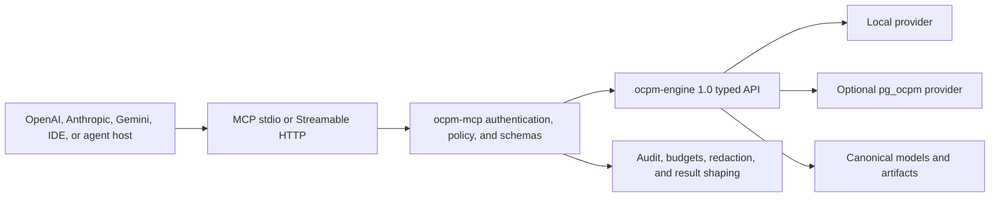

# ocpm-mcp feasibility and product specification

Status: feasible; recommended as a separate beta after the engine 1.0 API freeze  
Owner: proposed ocpm-mcp maintainers  
Snapshot date: 2026-08-03

## 1. Recommendation

Build `ocpm-mcp` as a small, separately versioned Rust server that depends only
on the public `ocpm-engine` API. Do not put MCP, OAuth, HTTP, or LLM-provider
dependencies into `pg_ocpm` or the engine's core algorithm crates. Do not let
the MCP server connect directly to PostgreSQL.

Feasibility is high:

| Dimension | Assessment | Reason |
|---|---|---|
| Technical | High | MCP maps cleanly to the engine's typed request/result operations; an [official Rust SDK](https://github.com/modelcontextprotocol/rust-sdk) exists |
| Provider interoperability | Medium-high | OpenAI, Anthropic, and Gemini document remote MCP support, but their supported transports/features and maturity differ |
| Runtime overhead | Low for mining work | JSON/tool and network overhead is normally small relative to discovery, conformance, or predictive analysis; tiny metadata calls need caching/batching |
| Security effort | High | Process data can contain sensitive business, identity, and free-text fields; model-controlled tools require strict authorization and output control |
| Dependency risk | Medium | The protocol changed materially in 2026 and provider connectors do not expose every MCP primitive uniformly |
| Product value | High if governed | It gives existing LLM applications a standard read-only process-analysis interface without custom SDK integration per provider |

The proposed release sequence is `ocpm-mcp 0.1.0-beta` after the
`ocpm-engine 1.0.0` request/result contracts are frozen. It is not a blocker for
the two 1.0.0 core releases. A production `ocpm-mcp 1.0.0` requires the
cross-provider and security gates in this document.

## 2. Evidence for interoperability

The current [MCP 2026-07-28 specification](https://modelcontextprotocol.io/specification/2026-07-28)
uses stateless, self-contained JSON-RPC requests and defines resources, prompts,
and model-controlled tools. It also defines optional extensions such as Tasks
for long-running operations. Its [authorization specification](https://modelcontextprotocol.io/specification/2026-07-28/basic/authorization)
uses an OAuth resource-server model, protected-resource discovery, audience
binding, least-privilege scopes, and issuer validation.

Current provider evidence:

- [OpenAI's Responses API](https://developers.openai.com/api/docs/guides/tools-connectors-mcp)
  supports remote MCP servers over Streamable HTTP or HTTP/SSE, OAuth bearer
  authorization, tool allowlists, and per-call approval policy.
- [Anthropic's Messages API MCP connector](https://platform.claude.com/docs/en/agents-and-tools/mcp-connector)
  supports remote Streamable HTTP or SSE servers, OAuth bearer tokens, multiple
  servers, and tool allow/deny configuration, but currently exposes tools rather
  than the full MCP primitive set.
- [Gemini's Interactions API](https://ai.google.dev/gemini-api/docs/function-calling#remote_mcp_model_context_protocol)
  supports remote MCP tools and currently requires Streamable HTTP rather than
  SSE.

Therefore the portable minimum is typed tools over Streamable HTTP. Resources,
prompts, Tasks, SSE compatibility, and local stdio improve particular clients
but cannot be prerequisites for the primary use cases.

## 3. Product boundary



`ocpm-mcp` is an adapter and policy enforcement point. It does not implement
mining algorithms, translate natural language to SQL, or choose database
indexes. It constructs typed engine requests, validates authorization and
budgets, and serializes bounded structured results.

The server has no dependency on an OpenAI, Anthropic, Google, or other LLM SDK.
Provider APIs connect to it as MCP clients. This avoids provider lock-in and
keeps customer process data under the deployment's control until an authorized
tool result is returned to the chosen provider.

## 4. Deployment modes

| Mode | Transport | Authentication | Use |
|---|---|---|---|
| Local developer | stdio | environment/process identity | Desktop agents, IDEs, local files |
| Private service | Streamable HTTP through private tunnel/gateway | OAuth/OIDC bearer token | Enterprise agents and hosted provider APIs without public data service |
| Public remote | HTTPS Streamable HTTP | OAuth/OIDC, tenant scopes, gateway policy | Multi-tenant managed service |
| Compatibility | HTTP/SSE where SDK supports it | same as HTTP | Older OpenAI/Anthropic clients only; not the normative path |

Target MCP protocol `2026-07-28`. The implementation negotiates compatible
versions supported by the selected official Rust SDK. Protocol-specific code is
isolated behind a transport module so a protocol update cannot change engine
semantics.

## 5. Version 0.1 tool surface

Tool count stays small enough for reliable model selection. All tools are
read-only with respect to source process data. Model artifacts and run records
are controlled derived data, not mutations to the source log.

| Tool | Purpose | Minimum scope | Default output |
|---|---|---|---|
| `list_datasets` | List authorized dataset IDs, names, schemas, and watermarks | `datasets:list` | metadata only |
| `describe_dataset` | Profile types, activities, time range, counts, and data quality | `datasets:read` | aggregates only |
| `query_process` | Execute the typed object/event/relationship constraint AST | `analysis:run` | factorized bindings, capped |
| `discover_process` | DFG/OC-DFG, process tree, Petri net, OCPN, or OC-DECLARE discovery | `analysis:run` | model summary plus artifact URI |
| `check_conformance` | Replay, alignment, quality, DECLARE, or constraint conformance | `analysis:run` | aggregate metrics and bounded violations |
| `analyze_performance` | Durations, bottlenecks, rework, throughput, organizational views | `analysis:run` | aggregate metrics |
| `compare_process_windows` | Compare DFGs, variants, activity, or performance across windows | `analysis:run` | signed changes and support |
| `detect_drift` | Score and localize behavioral/performance drift | `analysis:run` | score and bounded contributors |
| `predict_next_activity` | Rank next activities for an authorized execution state | `prediction:run` | top-k probabilities and provenance |
| `predict_remaining_time` | Estimate remaining time and intervals | `prediction:run` | point/interval estimate and provenance |
| `predict_outcome` | Score configured outcome/risk labels | `prediction:run` | probabilities, calibration, feature provenance |
| `explain_execution` | Show the engine's logical/physical plan and cost/resource estimate | `analysis:explain` | redacted plan |

Each tool has a closed JSON Schema 2020-12 input and output. Unknown fields are
rejected. Dataset views, filters, algorithms, metrics, windows, result limits,
and model IDs are typed enums/objects. There is no `sql`, `expression`, `path`,
`url`, shell command, dynamic code, or arbitrary provider request field.

### 5.1 Shared input envelope

```json
{
  "request_version": "1.0",
  "dataset": { "tenant_id": "t_123", "dataset_id": "d_456" },
  "view": {
    "start": "2026-01-01T00:00:00Z",
    "end": "2026-02-01T00:00:00Z",
    "object_types": ["order", "item"]
  },
  "limits": {
    "max_result_rows": 1000,
    "max_result_bytes": 1000000,
    "timeout_ms": 30000
  }
}
```

The authenticated tenant comes from the token. If an input tenant is retained
for clarity, it must exactly match the token and cannot select another tenant.

### 5.2 Shared result envelope

```json
{
  "schema_version": "1.0",
  "request_id": "req_...",
  "status": "complete",
  "result": {},
  "artifact_uris": [],
  "provenance": {
    "dataset_id": "d_456",
    "source_watermark": "2026-01-31T23:00:00Z",
    "engine_version": "1.0.0",
    "content_hash": "sha256:..."
  },
  "limits": {
    "truncated": false,
    "rows_returned": 12,
    "bytes_returned": 4821
  },
  "warnings": []
}
```

Truncation is explicit and includes a safe continuation/artifact handle where
authorized. A tool never describes a partial conformance search or approximate
quantile as exact.

## 6. Resources and prompts

Resources are useful for MCP hosts that support them, but every core workflow
also works through tools because current provider connectors are commonly
tools-only.

Recommended resources:

- `ocpm://datasets/{dataset_id}/profile`
- `ocpm://datasets/{dataset_id}/schema`
- `ocpm://models/{model_id}`
- `ocpm://runs/{run_id}`
- `ocpm://artifacts/{artifact_id}`

Resource reads enforce the same scopes and byte limits as tools. URIs are opaque
IDs, not filesystem paths or signed external URLs.

Optional prompts may guide common analyses such as “compare two periods,”
“investigate a bottleneck,” or “explain a conformance failure.” Prompts contain
workflow instructions only. They do not embed process data, credentials,
provider-specific system prompts, or claims that tool output is correct without
checking its status/provenance.

## 7. Long-running analyses

Discovery and alignments can exceed ordinary HTTP/model timeouts. If the client
negotiates the MCP Tasks extension, `ocpm-mcp` may return a task handle and
support get/cancel through the extension. Without Tasks support:

- work that fits the requested deadline completes synchronously;
- bounded artifact generation can return an explicit `run_id` only after the
  server has durably accepted the run;
- `get_analysis_run` and `cancel_analysis_run` compatibility tools may be
  enabled as a separate tool profile; and
- the server never continues expensive work after returning an unqualified
  timeout unless it provided a durable handle and the caller authorized
  asynchronous execution.

Task/run records contain tenant, request hash, dataset watermark, state,
progress, resource use, expiration, and artifact IDs. They never store OAuth
tokens or raw model prompts.

## 8. Authorization model

Remote HTTP deployments follow the MCP authorization specification and act as
an OAuth resource server. Minimum scopes:

- `datasets:list`
- `datasets:read`
- `events:read` for raw event/object values
- `analysis:run`
- `analysis:explain`
- `prediction:run`
- `models:read`

Aggregate access does not imply raw-event access. By default, tools omit raw
attributes, external identities, and individual event text. `events:read` is an
explicit step-up scope and remains subject to field-level policy.

Tokens must be audience-bound to the canonical MCP endpoint and validated for
issuer, signature, expiry, scope, tenant, and authorized datasets. Token
passthrough to PostgreSQL or another service is prohibited. The server uses its
own narrowly scoped downstream identity after enforcing the caller's policy.

Stdio mode reads credentials from the environment or host-controlled channel,
consistent with MCP guidance; it does not run an interactive OAuth server.

## 9. Threat model and controls

| Threat | Required control |
|---|---|
| Cross-tenant access | token-derived tenant, dataset ACL, provider tenant contract, tenant in every cache/artifact key |
| Prompt injection in activity/attribute text | treat all process values as untrusted structured data; never concatenate into tool descriptions, prompts, SQL, code, or URLs |
| Model invents broad/expensive query | closed schemas, view and row/byte/time/memory/cost caps, preflight estimate, rate/concurrency quotas |
| Sensitive row exfiltration | aggregate-first outputs, separate `events:read`, field allowlists/redaction, k-anonymity/minimum-support option |
| Arbitrary SQL/file/network access | no such parameters; engine typed API only; outbound network disabled except explicit infrastructure dependencies |
| Tool-description poisoning | static reviewed tool schemas/descriptions included in signed build; no dataset content in descriptions |
| Result mistaken for complete/exact | status, truncation, approximation, support, watermark, artifact/model version, and warnings always present |
| Token theft/confused deputy | TLS, audience/resource binding, issuer validation, short token lifetime, no token passthrough, protected-resource metadata |
| Denial of service | request size/depth limits, per-tenant quotas, bounded queues, cancellation, memory/spill budgets, global admission control |
| Audit leakage | structured metadata-only audit by default; hash sensitive arguments; configurable retention and residency |
| LLM/provider retention | deployment disclosure and policy gate before raw results leave the MCP server; document provider and MCP-server retention separately |

There are no write tools in the first production release. Any future import,
refresh, model promotion, annotation, or mutation tool requires a separate
threat model, idempotency key, preview, human approval, audit, and rollback.

## 10. Result shaping for LLMs

The engine's canonical result remains the source of truth. `ocpm-mcp` may shape
it for context efficiency only by:

- returning summaries plus artifact/resource handles;
- applying caller-requested top-k and explicit limits;
- serializing models in compact canonical JSON;
- omitting execution diagnostics unless requested; and
- paginating factorized results without changing multiplicity.

The adapter may not have an LLM summarize results internally, fabricate missing
causes, relabel approximate metrics as exact, or drop warnings. Natural-language
interpretation belongs to the client model and should cite tool result IDs and
watermarks.

## 11. Observability and operations

Record OpenTelemetry spans from MCP request through engine/provider operators.
Metrics include request/tool counts, p50/p95/p99 latency, queue time, engine and
provider time, rows/bytes returned, result truncation, provider choice/fallback,
task state, cancellation, auth failures, rate limits, and resource-limit errors.

Logs contain request IDs, hashed tenant/dataset IDs where configured, tool name,
policy decision, versions, status, and resource totals. They exclude tokens,
DSNs, raw attributes, external object/event IDs, model prompts, and unredacted
tool results.

Tool-list/schema responses use the protocol's cache semantics where available.
Analysis results are not shared across callers unless the engine artifact and
authorization policy explicitly permit it.

## 12. Performance requirements

- MCP serialization and policy overhead for `list_datasets`,
  `describe_dataset`, and `explain_execution` is below 10 ms p50 and 25 ms p95
  on the reference deployment, excluding engine/provider time and network RTT.
- For analyses longer than 100 ms, server overhead is below 5% of total p50
  latency or 15 ms, whichever is greater.
- Structured result generation is streaming/bounded and never duplicates a
  complete engine result in multiple in-memory JSON values.
- At 32 concurrent authorized requests, the MCP layer does not reduce engine
  throughput by more than 10% compared with the equivalent direct API calls.
- Tool/schema token footprint is measured for OpenAI, Anthropic, and Gemini;
  the default profile has exactly the 12 tools in section 5 and supports
  provider allowlists. Optional run tools are a separate profile.

These gates do not permit weakening authorization, auditing, exactness, or
output limits.

## 13. Compatibility test matrix

At minimum, release qualification tests:

| Client path | Transport | Required behavior |
|---|---|---|
| Official MCP inspector/client | stdio | discovery, every tool, schemas, errors, cancellation |
| Official MCP inspector/client | Streamable HTTP | stateless requests, discovery/cache metadata, auth challenges |
| OpenAI Responses API | Streamable HTTP | list, allowlisted calls, OAuth, approval behavior, structured results |
| Anthropic Messages API connector | Streamable HTTP | tool calls, OAuth, allow/deny profile, errors |
| Gemini Interactions API | Streamable HTTP | tool discovery and calls under documented constraints |

Provider tests use a non-sensitive fixture and never rely on an LLM's prose as
the correctness oracle. The test asserts the MCP tool inputs/outputs and compares
the result payload/hash with a direct engine call.

## 14. Delivery estimate and sequence

These are engineering ranges after the engine 1.0 facade is stable, not calendar
commitments:

1. protocol/schema spike and direct-engine parity: 1 engineer-week;
2. stdio plus Streamable HTTP read-only beta and 12 tools: 2-4 engineer-weeks;
3. OAuth/OIDC, tenant/field policy, budgets, audit, and task handling: 3-5
   engineer-weeks;
4. provider compatibility, security review, fuzz/load tests, docs, and packaging:
   2-3 engineer-weeks.

Expected total is 3-5 engineer-weeks for a local/private beta or 8-12
engineer-weeks for a production multi-tenant remote server. Existing identity,
gateway, and policy infrastructure can reduce the latter; a custom authorization
stack can increase it.

Recommended sequence:

1. freeze engine request/result JSON schemas and artifact URIs;
2. implement an in-process adapter test harness with direct-call parity;
3. ship stdio with non-sensitive fixtures for developer feedback;
4. add Streamable HTTP and official MCP conformance tests;
5. add OAuth, scopes, tenant/field policy, budgets, audit, and private deployment;
6. validate OpenAI, Anthropic, and Gemini paths;
7. security review and limited read-only beta;
8. qualify production 1.0 only after operational evidence.

## 15. Go/no-go gates

Proceed with the beta if:

- engine 1.0 request/result schemas can be invoked without provider-specific
  types;
- all 12 tools are thin mappings to engine calls;
- direct engine and MCP payload hashes match on the fixture suite;
- no raw SQL, path, URL, code, or unrestricted result field is necessary; and
- a real product workflow benefits from LLM access to process evidence rather
  than using MCP only as a demo.

Do not call it production-ready until:

- OAuth audience/issuer/scope and cross-tenant tests pass;
- raw-versus-aggregate authorization, field redaction, quotas, cancellation,
  task expiry, and audit retention are verified;
- OpenAI, Anthropic, Gemini, stdio, and direct-engine parity tests pass;
- prompt-injection, schema fuzz, SSRF, resource exhaustion, and result
  exfiltration reviews pass;
- latency/throughput overhead stays within the stated gates; and
- deployment, privacy, data-residency, incident-response, and version-support
  documentation is complete.

## 16. Non-goals

- an autonomous process-management agent;
- natural-language-to-SQL;
- direct database connectivity from MCP tools;
- LLM inference inside the server;
- provider-specific tool implementations;
- source-data imports or mutations in the initial release;
- returning unlimited raw event logs to a model; and
- treating LLM interpretation as a conformance, discovery, or prediction oracle.

## 17. Normative implementation manifest

The recommended implementation is a new sibling repository named `ocpm-mcp`.
All paths in this section are relative to that repository root. It depends on a
released `ocpm-engine` crate/API and has no path dependency in release builds.

| Path | Required change and definition of done |
|---|---|
| `Cargo.toml` | Binary/library workspace; pin official MCP Rust SDK, engine, HTTP, OAuth/JWT, schema, telemetry, and audit dependencies |
| `src/main.rs` | Configuration and transport startup only |
| `src/server.rs` | MCP discovery, tool/resource dispatch, protocol-version isolation, and stable errors |
| `src/tools/*.rs` | One thin mapping module per tool in section 5 |
| `src/policy/{auth,scope,field,budget,tenant}.rs` | OAuth validation, ACL/scopes, aggregate/raw field policy, admission, and tenant enforcement |
| `src/result/{shape,cursor,artifact}.rs` | Bounded shaping, opaque continuations, and artifact/run store traits |
| `src/transport/{stdio,http}.rs` | stdio and stateless Streamable HTTP; compatibility SSE is optional |
| `src/task.rs` | Negotiated MCP Tasks plus explicit compatibility run handles |
| `src/audit.rs` | Redacted structured audit events and retention hooks |
| `schemas/tools/*.schema.json` | Exact closed input/output JSON Schema 2020-12 for each tool |
| `tests/direct_parity.rs` | Tool mapping payload equals the corresponding direct engine result hash |
| `tests/auth.rs` | issuer/audience/signature/expiry/scope/tenant/dataset/field negative matrix |
| `tests/protocol.rs` | official MCP conformance, stdio, Streamable HTTP, discovery/cache, error, task, and cancellation tests |
| `tests/provider-matrix.toml` | MCP/provider API/model/header/transport pins and last verified dates |
| `deploy/` | Non-root container, health/readiness, protected-resource metadata, example gateway, resource limits, and SBOM |
| `docs/` | Tool examples, OAuth setup, private deployment, privacy/residency, incident response, and version policy |

### 17.1 Exact tool-to-engine mapping

| MCP tool | Engine call | Result projection |
|---|---|---|
| `list_datasets` | deployment catalog, then `describe` only for authorized IDs when requested | ID/name/schema/watermark; no counts unless scoped |
| `describe_dataset` | `describe(DescribeRequest)` | `DatasetProfile` through aggregate field policy |
| `query_process` | `query(QueryRequest)` | canonical factorized bindings and witnesses, capped |
| `discover_process` | `discover(DiscoveryRequest)` | artifact metadata, bounded model summary, artifact URI |
| `check_conformance` | `conformance(ConformanceRequest)` | metrics and capped per-execution violations |
| `analyze_performance` | `enhance(EnhancementRequest::Performance)` | units/support/metrics and capped groups |
| `compare_process_windows` | `enhance(EnhancementRequest::WindowComparison)` | aligned signed differences and support |
| `detect_drift` | `monitor(MonitoringRequest::Drift)` | score, method, windows, capped contributors |
| `predict_next_activity` | `predict(PredictionRequest::NextActivity)` | top-k probability/calibration/provenance |
| `predict_remaining_time` | `predict(PredictionRequest::RemainingTime)` | estimate/quantiles/coverage provenance |
| `predict_outcome` | `predict(PredictionRequest::Outcome or Risk)` | label probabilities/calibration/feature schema |
| `explain_execution` | `explain(ExplainRequest)` | redacted operators, estimates, provider/fallback; no DSN/paths |

Mapping modules only validate MCP envelopes, apply policy/limits, call the listed
engine method once, and shape the canonical result. Any need for a second
provider-specific call is a design failure and blocks beta.

### 17.2 Schema defaults and limits

Every JSON schema sets `additionalProperties: false`. Common production defaults
are 256 KiB request bytes, nesting depth 24, 100 AST nodes, 500 result rows,
1 MiB result bytes, 30-second deadline, 256 MiB engine memory, 1 GiB spill, and
cost budget 30 CPU-seconds. Deployment policy may lower defaults. Raising one
requires an authorized token claim and never exceeds operator hard limits:
1 MiB request, depth 32, 1,024 AST nodes, 100,000 rows, 64 MiB result, 15-minute
deadline, 4 GiB memory, 20 GiB spill, or 900 CPU-seconds.

Tool schemas reference the released engine schemas by copied content hash. The
build fails if generated Rust types, tool schemas, and the declared engine
schema hash disagree. Time ranges are half-open and all timestamps are UTC RFC
3339 microsecond precision.

### 17.3 Continuations, runs, and artifacts

Scan continuations are opaque authenticated tokens containing tenant, dataset,
source watermark, semantic request hash, stable sort key, remaining limits, and
expiry. They use authenticated encryption or HMAC plus server-side key rotation,
expire after 15 minutes, and cannot raise the original limits. A changed
watermark returns `stale_continuation` rather than mixing generations.

The storage interface is:

```rust
trait RunArtifactStore {
    async fn put_run(&self, run: RunRecord) -> Result<RunId>;
    async fn update_run(&self, expected_version: u64, run: RunRecord) -> Result<()>;
    async fn get_run(&self, tenant: TenantId, id: RunId) -> Result<RunRecord>;
    async fn put_artifact(&self, artifact: &[u8], metadata: ArtifactMetadata)
        -> Result<ArtifactId>;
    async fn get_artifact(&self, tenant: TenantId, id: ArtifactId)
        -> Result<ArtifactStream>;
}
```

IDs are 128-bit random opaque values; content hash is separate. Local beta uses
an owner-only directory. Production uses an encrypted durable object/metadata
store supplied by the deployer. Run records expire after 24 hours and result
artifacts after 7 days by default; model artifacts follow deployment policy.
Cleanup is tenant-scoped and audited. Artifact bytes never appear in logs or
continuation tokens.

Run states are `accepted`, `running`, `input_required`, `complete`, `failed`,
`cancelled`, or `expired`, with optimistic versioning. Without negotiated MCP
Tasks, compatibility run tools are disabled by default and enabled as one
explicit profile adding `get_analysis_run` and `cancel_analysis_run`.

### 17.4 OAuth and tenant claims

Production HTTP accepts only HTTPS behind a trusted proxy configuration. It
publishes OAuth protected-resource metadata and validates JWT or introspected
opaque tokens against configured issuers. JWT validation requires an allowed
algorithm, current signature key, exact issuer, canonical MCP endpoint audience,
expiry, optional not-before, and maximum 5-minute clock skew. JWKS cache lifetime
does not exceed the issuer cache header or one hour; an unknown key triggers one
bounded refresh.

The normative claims mapping is configured once per issuer:

```text
subject       -> sub
tenant        -> ocpm_tenant
scopes        -> scope (space-delimited) or scp (array)
datasets      -> ocpm_datasets (array, optional; absent means catalog ACL lookup)
max_cost      -> ocpm_max_cost_seconds (optional upper bound)
raw_fields    -> ocpm_raw_fields (array, requires events:read)
```

Tokens do not supply database roles, DSNs, artifact paths, or arbitrary policy
expressions. ACL/policy denies override token claims. OAuth tokens are held only
for request validation and never forwarded to the engine, PostgreSQL, artifact
store, logs, or provider APIs.

### 17.5 Stable MCP errors

Protocol/JSON-RPC errors remain protocol-correct. Tool results use stable codes:

`invalid_request`, `unsupported_version`, `unauthenticated`, `forbidden_scope`,
`forbidden_dataset`, `forbidden_field`, `not_found`, `stale_continuation`,
`cost_limit`, `resource_limit`, `timeout`, `cancelled`, `engine_error`,
`artifact_expired`, or `internal`.

Errors return request ID, retryable, redacted field path, current/allowed limit
where safe, and engine error code where applicable. They never include token,
prompt, process attribute value, external identity, DSN, internal path, stack
trace, or raw upstream response.

### 17.6 Provider compatibility pins

`tests/provider-matrix.toml` initially declares:

- MCP protocol `2026-07-28`, official Rust SDK exact crate/source revision, and
  official conformance-suite revision;
- OpenAI Responses API remote MCP with Streamable HTTP, explicit `allowed_tools`
  and approval policy, plus exact API/model identifier used on the test date;
- Anthropic Messages API beta header `mcp-client-2025-11-20`, Streamable HTTP,
  explicit tool allowlist, plus exact API/model identifier;
- Gemini Interactions API remote MCP, Streamable HTTP, explicit allowed tools,
  plus exact API/model identifier.

The exact provider model IDs and SDK revisions are frozen in Phase 0 because
they change independently of this repository. A production release requires a
successful run no more than 14 days before tagging. A later provider change can
mark one connector `degraded` without changing MCP/engine semantics; docs state
the last verified date and known constraint.

### 17.7 Reference deployment and load method

MCP-layer performance uses a Linux amd64 container limited to 4 vCPU, 8 GiB
RAM, no swap, and loopback access to an in-process/local engine fixture. Release
metadata records the exact CPU, kernel, container image digest, Rust version,
MCP SDK, engine version, and configuration. Provider-network tests report RTT
separately and do not enforce the local overhead thresholds.

Serial tests use three warmups and at least 100 measured calls. Concurrent tests
use 1/8/16/32 clients for at least 30 seconds after a 10-second ramp and at
least 500 completed calls. Direct-engine and MCP arms use identical requests and
result hashes. Report median/p95/p99, throughput, error/timeout rate, allocated
bytes, RSS, serialized bytes, and schema/tool token counts.

### 17.8 Milestone definitions of done

- Protocol spike: exact engine/tool mapping compiles, direct parity passes for
  all 12 tools, and no provider-specific or raw execution field is needed.
- Local beta: stdio, closed schemas, fixtures, limits, redaction, cancellation,
  audit, packaging, and direct parity pass on Linux/macOS.
- Private HTTP beta: Streamable HTTP, discovery/cache, OAuth validation, scopes,
  tenant/dataset/field policy, protected-resource metadata, rate/admission
  control, and private deployment tests pass.
- Async beta: Tasks and optional compatibility run profile pass acceptance,
  cancellation, expiry, restart, and artifact authorization tests.
- Provider candidate: OpenAI, Anthropic, Gemini, official MCP conformance, and
  last-14-day provider matrix pass with pinned evidence.
- Production 1.0: threat-model review, schema/auth fuzz, SSRF/resource attacks,
  cross-tenant tests, load gates, privacy/residency/incident docs, license/SBOM,
  signed container/tag, and rollback deployment pass.
