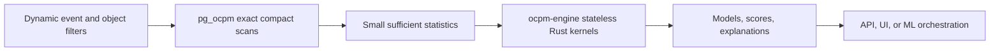

# Process-mining capability map and execution boundary

Snapshot date: 2026-07-19.

This review uses public documentation and papers to identify established
process-mining functions. It does not copy implementation code from the
projects below. In particular, GPL and AGPL projects are capability references,
not implementation sources.

## Open-source landscape

GitHub stars are a point-in-time popularity signal, not a quality ranking.

| Project | Snapshot | License | Documented emphasis | Use in this project |
|---|---:|---|---|---|
| [PM4Py](https://github.com/process-intelligence-solutions/pm4py) | 984 stars | AGPL-3.0 | Broad discovery, conformance, enhancement, filtering, statistics, and prediction | Version-pinned benchmark/reference baseline; not linked into the production runtime |
| [bupaR](https://github.com/bupaverse/bupaR) | 61 stars | MIT | Event-log handling, descriptive statistics, filtering, and process maps in R | Permissive capability reference |
| [OCPA](https://ocpa.readthedocs.io/en/latest/) | 44 stars | GPL-3.0 | OCEL management, object-centric discovery, variants, conformance, performance, and predictive features | Documentation-only OCPM baseline |
| [Cortado](https://github.com/cortado-tool/cortado) | 41 stars | GPL-3.0 | Interactive and incremental process discovery | Documentation-only capability baseline |
| [PM4JS](https://github.com/pm4js/pm4js-core) | 39 stars | BSD-3-Clause | Browser/Node discovery, conformance, filtering, simulation, statistics, and OCEL features | Permissive capability reference |
| [Rust4PM](https://github.com/aarkue/rust4pm) | 29 stars | Apache-2.0 | High-performance Rust process-mining foundations and language bindings | Permissive architectural reference |
| [Ebi](https://github.com/BPM-Research-Group/Ebi) | 16 stars | MIT | Stochastic process-mining analysis | Permissive future-model reference |
| [ProM](https://sourceforge.net/projects/prom/) | not GitHub-hosted | GPL-3.0 core; plug-ins commonly LGPL | Extensible discovery, conformance, enhancement, event-log, Petri-net, BPMN, and process-tree tooling | Documentation-only capability baseline |

Repository licenses were read from current repository metadata or the package
manifest in bupaR's case. A future dependency must still pass a complete
transitive-license and provenance review; a permissive top-level license alone
does not approve reuse.

## Common function families

The projects and surveys converge on these reusable families:

1. **Data and slicing:** import/export, lifecycle ordering, event/object/case
   selection, activity existence and nonexistence, attribute and duration
   predicates, and time windows.
2. **Descriptive discovery:** activity, start/end, DFG, variant, handoff, and
   object-interaction statistics; procedural or declarative model discovery.
3. **Conformance:** frequency coverage, token replay, alignments, constraint
   checking, fitness, precision, generalization, and simplicity.
4. **Enhancement and monitoring:** bottlenecks, rework, performance overlays,
   time series, organizational views, anomalies, and concept drift.
5. **Prediction and prescription:** next activity, remaining time, outcomes,
   risk, recommendations, and simulation.

## Placement rule

An operation belongs in `pg_ocpm` when its correctness depends on exact event,
object, tenant, timestamp, or attribute predicates and it can reduce many facts
to a small reusable result. It belongs in `ocpm-engine` when it consumes those
small results, maintains or scores a model, benefits from independent CPU
scaling, or would otherwise retain large algorithm state inside PostgreSQL.

| Function | Placement | Performance reason | Marginal storage | Concurrency reason |
|---|---|---|---:|---|
| Dynamic case/object filtering | `pg_ocpm` | Apply exact predicates before network transfer | Existing capsules/indexes | PostgreSQL plans and MVCC own read semantics |
| DFG, variant, rework, duration, time-series, and feature counts | `pg_ocpm` | Native scans reduce arrays to sufficient statistics | Existing capsules/indexes | Short bounded database work; no hydrated event tables |
| Activity/case/start/end profile | `pg_ocpm` | Reuses filtered compact case capsules | **0 bytes** | One database request; no middleware path expansion |
| DFG/variant/activity drift | `ocpm-engine` | Linear arithmetic over aligned count vectors | **0 bytes** | GIL-releasing Rust; can scale outside database backends |
| Frequency conformance, deterministic next activity, bottleneck ranking | `ocpm-engine` | Model construction does not need event rows | **0 bytes** | Stateless kernels can run concurrently and be cached |
| Token replay, alignments, Petri-net/process-tree discovery | `ocpm-engine` | Search/model state is CPU- and memory-intensive | Model artifacts only | Avoid monopolizing PostgreSQL workers and memory contexts |
| ML/GNN prediction, simulation, prescription | engine/service layer | Training, accelerators, and model lifecycle are not SQL concerns | External versioned models | Independently scheduled CPU/GPU workers |

The boundary deliberately avoids an index per algorithm. New analyses should
first reuse aligned DFG, variant, activity, duration, or adjacency sufficient
statistics. A new persisted representation is justified only by an exact,
correctness-gated public benchmark that includes load/WAL cost and concurrent
write impact, not latency alone.

## Research signals and implementation choices

- [OCPQ (2025)](https://arxiv.org/abs/2506.11541) shows the value of expressive
  object-centric constraints, compact execution, and early filtering. The next
  query milestone should therefore compose existing primitives into a typed
  constraint tree rather than add isolated endpoint-specific indexes.
- [Multi-dimensional event-data operations
  (2024)](https://arxiv.org/abs/2412.00393) formalize fold, unfold, drill-down,
  and roll-up. These map naturally to database-side slicing followed by
  engine-side comparison.
- [HOEG (2024)](https://arxiv.org/abs/2404.05316) reports predictive gains from
  heterogeneous object-event interactions. Graph feature extraction belongs
  close to `pg_ocpm` adjacency, while model training and inference belong in
  the engine/service layer.
- [Comprehensive concept-drift characterization
  (2026)](https://doi.org/10.1016/j.is.2025.102584) uses directly-follows
  behavior across windows and motivates explainable localization, not only a
  binary drift flag. `ocpm-engine` therefore returns a bounded
  Jensen-Shannon score plus per-relation contributions and signed share change.
- [The OCED standardization proposal
  (2024)](https://arxiv.org/abs/2410.14495) reinforces keeping import adapters
  outside analytical kernels and retaining a source-neutral event/object
  contract.
- [High-performance Rust process mining
  (2024)](https://arxiv.org/abs/2401.14149) establishes Rust with Java/Python
  bindings as prior art. Rust is an implementation choice here; the measurable
  contribution must be the database/model boundary, compact statistics, and
  reproducible output equivalence.

## Deferred algorithms

Token replay and alignments need an explicit reference-model contract before
implementation. Object-centric Petri-net discovery needs formal semantics and
quality measures. Predictive GNNs need reproducible train/test splits, model
versioning, calibration, and accelerator-aware benchmarks. Simulation needs a
stochastic model and validated arrival/service distributions. Implementing any
of these as a PostgreSQL function now would prematurely freeze semantics and
increase backend resource contention without reducing persistent event reads.

The next broad milestone should be a typed object-centric constraint/query tree
that pushes exact leaves into `pg_ocpm`, combines bounded intermediate sets,
and evaluates model-aware nodes in `ocpm-engine`. It should be benchmarked with
selective and unselective activity, attribute, duration, and object-relation
predicates under concurrent ingest and query load.
