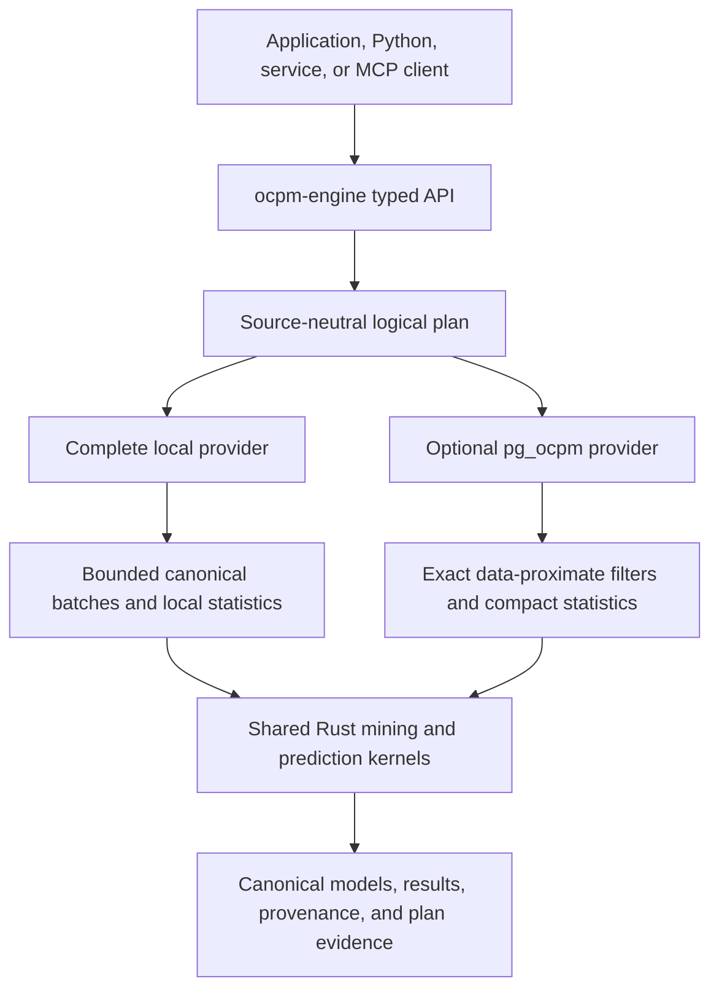

# Process-mining capability map and execution boundary

Snapshot date: 2026-08-03.

This review uses peer-reviewed papers to define implementation semantics.
Public project documentation is used only to inventory advertised capabilities
for black-box coverage and benchmark adapters. It is never an architecture,
algorithm, fixture, or implementation source, regardless of license.

## 1.0 strategic decision

The 1.0 architecture has three explicit boundaries:

1. `ocpm-engine` is a complete standalone, source-neutral Rust engine and the
   primary public API. Its local provider implements every mandatory use case.
2. `pg_ocpm` is an optional lossless PostgreSQL data and acceleration provider.
   When present, the engine transparently pushes exact selective scans,
   relationship traversal, and sufficient statistics close to the data.
3. `ocpm-mcp` is a separately versioned, read-only adapter over the engine for
   standards-based LLM connectivity. It never calls PostgreSQL directly and is
   not a dependency of either core runtime.

Provider choice may change latency, throughput, storage, memory, and transfer
volume, but never feature availability or canonical result semantics. The full
contracts are [ocpm-engine 1.0.0](ocpm-engine-1.0.0-spec.md),
[pg_ocpm 1.0.0](../../pg_ocpm/docs/pg-ocpm-1.0.0-spec.md), and the
[ocpm-mcp feasibility specification](ocpm-mcp-feasibility.md).

## Open-source projects

GitHub stars are a point-in-time popularity signal, not a quality ranking.

| Project | Snapshot | License | Documented emphasis | Use in this project |
|---|---:|---|---|---|
| [PM4Py](https://github.com/process-intelligence-solutions/pm4py) | 984 stars | AGPL-3.0 | Broad discovery, conformance, enhancement, filtering, statistics, and prediction | Version-pinned black-box benchmark baseline only |
| [bupaR](https://github.com/bupaverse/bupaR) | 61 stars | MIT | Event-log handling, descriptive statistics, filtering, and process maps in R | Advertised-capability inventory only |
| [OCPA](https://ocpa.readthedocs.io/en/latest/) | 44 stars | GPL-3.0 | OCEL management, object-centric discovery, variants, conformance, performance, and predictive features | Isolated black-box benchmark and coverage audit only |
| [Cortado](https://github.com/cortado-tool/cortado) | 41 stars | GPL-3.0 | Interactive and incremental process discovery | Advertised-capability inventory only |
| [PM4JS](https://github.com/pm4js/pm4js-core) | 39 stars | BSD-3-Clause | Browser/Node discovery, conformance, filtering, simulation, statistics, and OCEL features | Advertised-capability inventory only |
| [Rust4PM](https://github.com/aarkue/rust4pm) | 29 stars | Apache-2.0 | High-performance Rust process-mining foundations and language bindings | Isolated black-box benchmark and coverage audit only |
| [Ebi](https://github.com/BPM-Research-Group/Ebi) | 16 stars | MIT | Stochastic process-mining analysis | Advertised-capability inventory only |
| [ProM](https://sourceforge.net/projects/prom/) | not GitHub-hosted | GPL-3.0 core; plug-ins commonly LGPL | Extensible discovery, conformance, enhancement, event-log, Petri-net, BPMN, and process-tree tooling | Advertised-capability inventory only |

Repository licenses were read from current repository metadata or the package
manifest in bupaR's case. A future dependency must still pass a complete
transitive-license and provenance review; a permissive top-level license alone
does not approve reuse.

## Common function families

Peer-reviewed process-mining papers establish these reusable families; the
project inventory above is used only to check whether the public surface is
practically broad enough:

1. **Data and slicing:** import/export, lifecycle ordering, event/object/case
   selection, activity existence and nonexistence, attribute and duration
   predicates, and time windows.
2. **Descriptive discovery:** activity, start/end, DFG, variant, handoff, and
   object-interaction statistics; procedural or declarative model discovery.
3. **Conformance:** frequency coverage, token replay, alignments, constraint
   checking, fitness, precision, generalization, and simplicity.
4. **Enhancement and monitoring:** bottlenecks, rework, performance overlays,
   time series, organizational views, anomalies, and concept drift.
5. **Prediction and prescription:** next activity, remaining time, outcomes,
   risk, recommendations, and simulation.

## Placement rule

An operation is eligible for `pg_ocpm` pushdown when its correctness depends on
exact event, object, tenant, timestamp, qualifier, relationship, or attribute
predicates and it can reduce many facts to a smaller reusable result. The same
logical operation must have a bounded local-provider implementation.

Model search, discovery, conformance, enhancement interpretation, prediction,
and artifact lifecycle belong in `ocpm-engine`: they benefit from independent
CPU scaling, require source-neutral semantics, or would otherwise retain large
algorithm state inside PostgreSQL. The physical planner chooses the provider by
capability, selectivity, transfer, memory, and concurrency estimates, and makes
that choice observable through `explain()`.

| Function | Preferred placement | Performance reason | Marginal storage | Concurrency reason |
|---|---|---|---:|---|
| Lossless events, objects, E2O/O2O qualifiers, attribute histories | local canonical log or `pg_ocpm` | Preserve one canonical semantic model | Source data only | Snapshot/generation semantics belong to the provider |
| Dynamic case/object filtering | provider; push to `pg_ocpm` when beneficial | Apply exact predicates before network transfer | Generic indexes/capsules only | PostgreSQL plans and MVCC own database read semantics |
| DFG, variant, rework, duration, time-series, and feature counts | provider | Reduce scans to sufficient statistics | Reusable capsules only | Bounded database or local work; no Python event-table hydration |
| Object-centric constraint bindings | split by the physical planner | Push selective leaves/joins; retain unsupported nodes in Rust | Factorized results | Avoid Cartesian expansion in either layer |
| DFG/variant/activity/performance drift | `ocpm-engine` | Linear arithmetic over aligned statistics | 0 bytes | Stateless Rust scales outside database backends |
| Discovery and conformance search | `ocpm-engine` | Model/search state is CPU- and memory-intensive | Model artifacts only | Avoid monopolizing PostgreSQL workers and memory contexts |
| Next activity, remaining time, outcome/risk | `ocpm-engine`; provider extracts leakage-safe evidence | Model fitting, calibration, and artifacts are source-neutral | Versioned model artifacts | Independent CPU/GPU scheduling; no database backend model state |
| MCP tools and policy | separate `ocpm-mcp` | Thin typed adapter avoids provider/LLM coupling | Audit/run metadata | Gateway admission control independent from mining kernels |

The boundary deliberately avoids an index per algorithm. New analyses should
first reuse aligned DFG, variant, activity, duration, or adjacency sufficient
statistics. A new persisted representation is justified only by an exact,
correctness-gated public benchmark that includes load/WAL cost and concurrent
write impact, not latency alone.

## Peer-reviewed implementation choices

- [OCPQ (2025)](https://doi.org/10.1007/978-3-031-92474-3_23) defines
  expressive object-centric constraints and binding semantics. The query
  surface composes typed constraint trees, while database execution techniques
  come from the peer-reviewed systems papers in the provenance ledger.
- [Comprehensive concept-drift characterization
  (2026)](https://doi.org/10.1016/j.is.2025.102584) uses directly-follows
  behavior across windows and motivates explainable localization, not only a
  binary drift flag. `ocpm-engine` therefore returns a bounded
  Jensen-Shannon score plus per-relation contributions and signed share change.
- [Factorised Representations of Query Results
  (2015)](https://doi.org/10.1145/2656335) and [Morsel-Driven Parallelism
  (2014)](https://doi.org/10.1145/2588555.2610507) support compact intermediate
  results and bounded independent work units. They justify the provider/engine
  execution boundary without borrowing another process-mining implementation.

## 1.0 scope and sequencing

The common OCPQ/Rust4PM/OCPA use cases are now mandatory 1.0 scope rather than
an open-ended backlog:

- OCEL JSON/SQLite, XES, CSV mapping, validation, and lossless canonical
  event/object/E2O/O2O/attribute-history semantics; OCEL 2.0 XML is deferred
  until an eligible peer-reviewed source supports its detailed interchange;
- process executions, flattening/projection, dynamic filters, and a typed nested
  object-centric constraint/query tree;
- DFG/OC-DFG, linear/graph variants, process maps, Alpha-class and inductive
  discovery, process trees, Petri nets, OCPNs, and OC-DECLARE;
- frequency conformance, token replay, alignments, fitness/precision,
  OC-DECLARE, and witness-producing constraint checks;
- performance, rework, organizational views, time series, and localized drift;
- next-activity, remaining-time, and outcome/risk prediction with leakage-safe
  features, versioned artifacts, calibration, and time-ordered evaluation; and
- canonical model/result serialization and cross-provider provenance.

The implementation order is contract/fixtures, standalone local provider,
PostgreSQL provider and equivalence, query/discovery/conformance/enhancement,
prediction/monitoring, and finally full release qualification. Every capability
is accepted first against the local provider and then, where accelerated, by
canonical equality against `pg_ocpm`.

General-purpose deep-learning training, stochastic simulation, and prescriptive
optimization remain post-1.0 extension work. They are not common across all
three reference projects and need external accelerator/model/distribution
lifecycle contracts. The 1.0 prediction artifact and feature interfaces must
allow them later without changing canonical data or provider APIs.

## Benchmark and evidence strategy

Release qualification keeps distinct evidence boundaries:

- strict OCPQ Q1-Q7 on its published data and duplicate-preserving answers;
- common SAP O2C/P2P workloads across vanilla PostgreSQL + PM4Py,
  `pg_ocpm + PM4Py`, `pg_ocpm + ocpm-engine`, and semantically applicable OCPQ;
- pairwise Rust4PM and OCPA workloads on the unchanged datasets used by those
  projects; and
- Logistics or Order Management for conformance/reference-model behavior plus
  Angular GitHub Commits for non-ERP generalization.

Every suite uses pinned Docker images and exact-answer gates, then reports
latency, p95/p99, concurrency, memory, storage, load time, WAL, and transfer
bytes separately. A cell is `N/A` when semantics are incompatible. Planner code
cannot inspect benchmark IDs, dataset names, expected answers, or reference
engines. Performance improvements must generalize to selective/unselective,
dynamic, mixed-concurrency, and concurrent-ingest cases.

## MCP strategy

`ocpm-mcp` should ship after the engine API freeze as a separate read-only beta.
Its portable minimum is typed tools over Streamable HTTP; stdio supports local
developer clients, while resources/prompts/Tasks are optional enhancements
because provider support differs. The first surface covers dataset discovery,
typed queries, model discovery, conformance, performance, window comparison,
drift, next activity, remaining time, outcome/risk, and execution explanation.

The server uses aggregate-first output, explicit raw-event scope, OAuth
audience/issuer/tenant enforcement, field redaction, result/cost/time/memory
caps, cancellation, rate/concurrency limits, and structured audit. Event and
attribute text is untrusted data, never an instruction or executable fragment.
The MCP adapter calls only `ocpm-engine`; provider selection remains invisible
to the LLM-facing contract except in requested redacted diagnostics.
