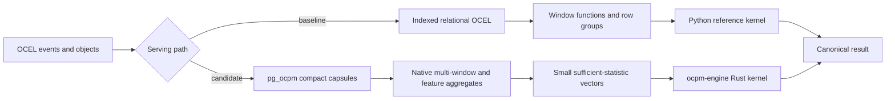

# Public common-process-mining performance

This report records the `pg_ocpm 0.3.0` and `ocpm-engine 0.2.0` release run on
the public SAP IDES O2C and P2P logs. All 14 workload/dataset pairs passed exact
canonical-output comparison before their latency samples were accepted. The
geometric-mean p50 speedup was **35.927x** and the slowest pair was **16.884x**,
so both release gates exceeded 10x.

The machine-readable result is
[`results/public-common-pm-0.2.0.json`](results/public-common-pm-0.2.0.json)
(file SHA-256
`9ae178fa13572a9e633df0143ec3f921581c909e9e60474abd5d868abc140103`).

## What was compared

The baseline is vanilla PostgreSQL 16 with a normalized relational OCEL schema,
seven appropriate B-tree indexes, and independent Python reference kernels.
It reconstructs lifecycles, directly-follows relations, variants, and duration
features at request time. The Python code follows ordinary dataframe/library
composition semantics, but **does not import or copy PM4Py**. It should be read
as a PostgreSQL-plus-Python baseline, not as a measured PM4Py release.

The candidate uses the same source facts, normalized once into `pg_ocpm` compact
serving capsules. Native PostgreSQL aggregates return counts and sufficient
statistics; `ocpm-engine` builds or scores the small model in Rust through a
stable-ABI Python binding.



The public source is Alessandro Berti's *Collection of Object-Centric Event
Logs*, DOI [10.5281/zenodo.8261133](https://doi.org/10.5281/zenodo.8261133),
licensed CC BY 4.0. The fixture verifies both archive and extracted SQLite
SHA-256 digests. The selected O2C backbone contains 98,350 events and 236,265
event-object links; P2P contains 24,854 events and 105,039 event-object links.

## Latency

Values are warm-cache p50 milliseconds from nine measured runs after two
warmups. Engine order is randomized per pair with seed `20260718`. Latency
includes database extraction/aggregation and model construction or scoring.

| Dataset | Workload | Vanilla PG + Python | pg_ocpm + Rust | Speedup |
|---|---|---:|---:|---:|
| SAP O2C | DFG frequency conformance, 95% | 37.530 | 1.151 | 32.606x |
| SAP O2C | Variant frequency conformance, 95% | 26.457 | 1.567 | 16.884x |
| SAP O2C | Next-activity prediction | 38.495 | 1.166 | 33.015x |
| SAP O2C | Repeated-transition rework | 39.463 | 2.008 | 19.653x |
| SAP O2C | Edge bottleneck ranking | 40.598 | 1.754 | 23.146x |
| SAP O2C | Edge bottleneck prediction | 96.779 | 2.617 | 36.981x |
| SAP O2C | Monthly edge-duration series | 249.027 | 2.276 | 109.414x |
| SAP P2P | DFG frequency conformance, 95% | 16.096 | 0.499 | 32.257x |
| SAP P2P | Variant frequency conformance, 95% | 27.654 | 0.395 | 70.010x |
| SAP P2P | Next-activity prediction | 15.686 | 0.436 | 35.977x |
| SAP P2P | Repeated-transition rework | 17.761 | 0.747 | 23.776x |
| SAP P2P | Edge bottleneck ranking | 16.192 | 0.508 | 31.874x |
| SAP P2P | Edge bottleneck prediction | 34.063 | 0.759 | 44.879x |
| SAP P2P | Monthly edge-duration series | 105.131 | 1.628 | 64.577x |

The step change comes from changing the unit of exchange. The baseline sends
or groups event/case rows after rebuilding order. The candidate scans aligned
capsule arrays in C and transfers only per-transition or per-variant count
vectors. `ocpm.window_cardinalities(...)` evaluates all requested train/test or
period windows in one aggregate state, so model evaluation does not rescan or
multiply the compact rows. PyO3 releases the Python GIL while deterministic
Rust kernels rank, select, and score those vectors.

## Storage

The measurement sums PostgreSQL heap, index, and TOAST relation bytes after the
same facts are loaded and analyzed. The baseline retains only relational OCEL;
the candidate retains the `ocpm` serving representation after staging rows are
removed.

| Representation | Heap | Indexes | TOAST | Total |
|---|---:|---:|---:|---:|
| Vanilla relational OCEL | 59.2 MiB | 113.9 MiB | <0.1 MiB | 173.3 MiB |
| pg_ocpm serving schema | 50.6 MiB | 19.7 MiB | 31.8 MiB | 102.3 MiB |

`pg_ocpm` used **41.0% less total space** and **82.7% less index space** in this
fixture. Its TOAST use is intentional: cold exact payload vectors are stored
out of line, while a small set of leading-key/time indexes prunes capsules.

## Concurrency

Concurrency replays the O2C DFG-conformance request 32 times at each worker
level. Each task opens a connection. Per-request latency starts after connection
setup; aggregate throughput wall time includes connection setup and teardown.
That makes throughput intentionally more conservative than a production pool.

| Workers | Vanilla p50 / p95 | Candidate p50 / p95 | Vanilla QPS | Candidate QPS |
|---:|---:|---:|---:|---:|
| 1 | 39.565 / 41.058 ms | 1.581 / 1.834 ms | 23.601 | 252.854 |
| 4 | 43.164 / 45.006 ms | 1.734 / 2.150 ms | 84.485 | 605.423 |
| 8 | 49.970 / 54.280 ms | 1.766 / 2.198 ms | 139.980 | 739.930 |
| 16 | 56.320 / 60.192 ms | 2.508 / 4.103 ms | 215.328 | 824.766 |

At 16 workers, candidate p50 remained **22.5x lower** and throughput was
**3.83x higher**. Throughput gains are smaller than latency gains because both
paths include connection churn and the candidate approaches the machine's
available database/client capacity sooner.

## Reproduce

From a checkout of `ocpm-engine`:

```sh
make perf-public
make perf-public-check
```

The runner obtains a sibling `pg_ocpm` checkout when available or clones tag
`v0.3.0`, builds the Rust wheel and both PostgreSQL images, checksum-verifies
the public data, recreates both databases, runs the benchmark, and stops all
containers on exit. The committed-result checker independently verifies its
payload digest, workload count, correctness flags, and per-workload 10x gate.

The recorded environment was PostgreSQL 16.14 on Linux/aarch64 with 18 logical
CPUs visible to Docker, `shared_buffers=1GB`, `effective_cache_size=4GB`,
`work_mem=16MB`, JIT disabled, and the same database settings on both sides.

## Published context, not cross-study comparison

Küsters and van der Aalst's
[*Developing a High-Performance Process Mining Library with Java and Python
Bindings in Rust*](https://arxiv.org/abs/2401.14149) already establishes Rust
plus language bindings as process-mining prior art. Its Alpha+++ experiments
report, for one BPI 2020 DD configuration, 0.6761 s for Python, 0.5925 s for
Java, 0.0675 s for single-threaded Rust, and 0.0120 s for parallel Rust. Those
numbers concern a different algorithm, log representation, machine, and timing
boundary and are not comparable to this suite.

The [OCPQ paper](https://arxiv.org/abs/2506.11541) evaluates a specialized
object-centric query engine against SQLite, Neo4j, and DuckDB and reports
performance comparable to DuckDB and better than the other two for its seven
query workloads. OCPQ's query language, dataset, baselines, and measurement
boundary differ from this common-PM suite. Its compact bindings, early filters,
and specialized execution reinforce the architectural direction, but no OCPQ
implementation was copied or linked here.

[PM4Py's paper](https://arxiv.org/abs/1905.06169) supplies ecosystem context.
The current PM4Py repository is AGPL-3.0/commercial; it was intentionally not
used as source code or a dependency. A future publication-quality study should
add a separately installed, version-pinned PM4Py baseline on identical
algorithms, inputs, hardware, and timing boundaries rather than infer PM4Py
performance from this independent Python reference implementation.

## Claim boundaries

- DFG and variant conformance are deterministic frequency-coverage models, not
  Petri-net token replay or optimal alignments.
- Next-activity and bottleneck prediction are transparent deterministic
  baselines. The benchmark measures execution, not predictive superiority.
- Results are medium-size, warm-cache, single-machine measurements. They do not
  establish distributed scale, ingest throughput, or universal superiority.
- Exact output equality is established for the implemented workloads. It does
  not establish equivalence for algorithms outside this suite.
- The architecture and results may support a research contribution, but
  novelty requires a formal prior-art review and independent replication.
