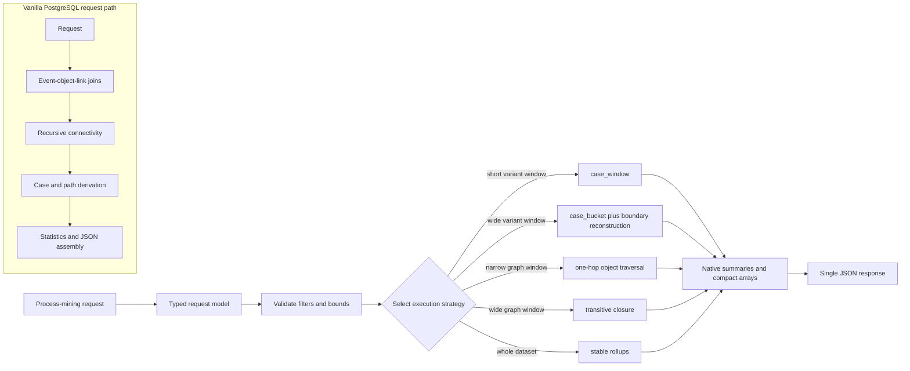

# Application query performance improvements over vanilla PostgreSQL

## Scope

`ocpm-engine` is the application query planner for `pg_ocpm >= 0.6.0`. It does
not create tables, indexes, materialized views, or another PostgreSQL
extension. Its performance contribution is to translate a small set of
process-mining request shapes into parameterized SQL that selects the most
appropriate `pg_ocpm` serving primitive.

The comparison in this document is architectural:

- **Vanilla PostgreSQL path:** derive cases, paths, object connectivity, and
  statistics from normalized event-object-link rows during each request.
- **`ocpm-engine` path:** push filters into finalized `pg_ocpm` structures,
  choose a bounded execution strategy, and return the API result as one compact
  JSON value.

Measured extension-level comparisons against vanilla PostgreSQL are maintained
in the `pg_ocpm` repository's `docs/benchmarks.md` report.

## Read-path architecture

The planner removes neither SQL nor PostgreSQL from the system. It makes the
expensive OCPM derivations a load/finalization concern and keeps request-time
SQL focused on selection, aggregation, and response construction.

## Enhancement summary

| Enhancement | Vanilla PostgreSQL cost avoided | Selected implementation |
|---|---|---|
| Typed request normalization | Endpoint-specific parsing and inconsistent defaults | Immutable request/filter models |
| Early dependency check | Failing after a costly query is planned or executed | `ocpm.version()` gate |
| Window-aware variants | One plan for both selective and broad windows | Case-window or segmented-bucket plan |
| Scope-aware graph traversal | Recursive closure for every graph request | One hop or closure based on scope |
| Filter pushdown | Expanding all connected objects before filtering | Filter seed cases and candidate buckets first |
| Vectorized edge analysis | Per-case adjacency expansion | Selected-ID array expansion |
| Page-before-hydration | Loading events and graph context for the full result set | Hydrate only the requested case page |
| Whole-dataset rollups | Recomputing the complete process map | Read finalized edge/day summaries |
| Database-side result shaping | Multiple result sets and application-side grouping | One ordered JSON value |
| Parameterized plans | SQL text variation and unsafe interpolation | Stable SQL plus bound parameters |

## 1. Typed request normalization

The request layer converts endpoint input into immutable, slotted data classes
before SQL selection. Nested activity, edge, duration, status, date, paging,
and traversal inputs become one canonical `ProcessMiningRequest`.

Code:

- [`EdgeFilter` and `NetworkFilter`](../src/ocpm_engine/models.py#L23-L61)
- [`ProcessMiningRequest` and mapping conversion](../src/ocpm_engine/models.py#L72-L108)
- [`QueryPlan`](../src/ocpm_engine/models.py#L111-L116)

Why it improves the read path:

1. Strategy selection operates on known types instead of repeatedly parsing
   dictionaries inside query builders.
2. Empty filters are normalized to tuples or `None`, so SQL can use stable
   predicates such as `parameter IS NULL OR ...`.
3. Endpoint SQL is predeclared rather than assembled from arbitrary request
   fragments, which preserves plan reuse and predictable result ordering.

This layer is a planning optimization, not a claim that Python parsing is
materially faster than PostgreSQL. Its value is that it reliably routes each
request to the optimized database primitive.

## 2. Fail-fast `pg_ocpm` capability gate

At application startup, `verify_pg_ocpm()` calls `ocpm.version()` and requires
version 0.6.0 or later. An incompatible database is rejected before serving
queries.

Code:

- [Required version and verification](../src/ocpm_engine/engine.py#L18-L57)
- [Version-check tests](../tests/test_engine.py#L175-L192)

This prevents a silent fallback to normalized relational scans or a late
failure after a request has already consumed database resources.

## 3. Time-window normalization and strategy threshold

All bounded endpoints receive explicit `from_date` and `to_date` parameters.
An omitted boundary is mapped to PostgreSQL-supported minimum or maximum
timestamps. The planner computes the request width once and uses a configurable
threshold, 30 days by default, to choose between selective and broad-window
plans.

Code:

- [Timestamp bounds and default threshold](../src/ocpm_engine/engine.py#L18-L40)
- [Window normalization](../src/ocpm_engine/engine.py#L75-L86)
- [Unbounded-window test](../tests/test_engine.py#L96-L100)

Compared with a single generic vanilla query, the threshold prevents narrow
requests from paying for a full-dataset path while allowing broad requests to
avoid repeated fine-grained lookups. The threshold is configurable because the
best crossover depends on dataset density, case duration, memory, and storage
latency.

## 4. Dual exact paths for variant analysis

Variant distribution has two exact plans:

- **Short windows:** call `ocpm.case_window(...)` and aggregate the selected
  cases.
- **Wide windows:** scan zone-map-pruned `ocpm.case_bucket` rows, accept cases
  fully contained by the window, and reconstruct only boundary-overlapping
  cases from compressed timestamps.

Planner and SQL:

- [Short/wide plan selection](../src/ocpm_engine/engine.py#L88-L99)
- [Short-window variant SQL](../src/ocpm_engine/queries.py#L3-L33)
- [Wide-window exact reconstruction](../src/ocpm_engine/queries.py#L36-L133)
- [Strategy-selection test](../tests/test_engine.py#L54-L63)

The broad-window plan is not an approximation. Full cases reuse their stored
path and duration; only cases intersecting a date boundary decode timestamps
and rebuild the clipped path. Vanilla PostgreSQL would typically revisit event
and object-link rows for every selected case, including cases whose finalized
path is already valid for the requested window.

## 5. One-hop versus transitive graph traversal

The process-map planner selects `ocpm.connected_objects_one_hop` for narrow
windows and `ocpm.connected_objects_closure` for wide or unbounded windows. A
caller can explicitly override this decision when semantic scope is known.

Code:

- [Traversal selection](../src/ocpm_engine/engine.py#L194-L208)
- [Dynamic primitive selection](../src/ocpm_engine/queries.py#L578-L626)
- [Wide-window closure test](../tests/test_engine.py#L87-L93)

This matters because transitive closure has a larger semantic and computational
scope than immediate connectivity. Running closure for every interactive
filter wastes work when the output only needs directly connected objects.
Conversely, forcing one hop for a wide dependency view would be faster but
incorrect. The planner keeps that choice explicit and testable.

## 6. Seed-first filter pushdown

Process-map filters are applied in stages:

1. `case_window` applies dataset, tenant, backbone type, date, and status.
2. Variant hashes reduce the eligible case set.
3. Case duration and backbone activities reduce the seed set.
4. Object traversal starts from only the selected case IDs.
5. Connected-activity and edge-duration filters scan only time-overlapping edge
   buckets and object IDs in the traversed set.

Code:

- [Activity classification and parameter mapping](../src/ocpm_engine/engine.py#L169-L194)
- [Seed-case filters](../src/ocpm_engine/queries.py#L581-L617)
- [Traversal from selected case IDs](../src/ocpm_engine/queries.py#L618-L626)
- [Connected-edge filtering](../src/ocpm_engine/queries.py#L641-L689)

In a vanilla relational plan, it is easy to recurse across the entire
event-object graph and filter afterward. This planner deliberately reduces the
case set before graph expansion and intersects edge buckets with the already
selected object set.

The activity prefix split is semantic: activities belonging to the backbone
object constrain case selection, while activities on connected objects
constrain the traversed network. Treating both as one late predicate would
either produce the wrong case population or expand unnecessary graph state.

## 7. Vectorized selected-case edge analysis

The edge-information endpoint first obtains selected case IDs, then passes the
entire ID array to `ocpm.adjacency_selected_id_rows(...)`. The resulting object
set is joined to time- and activity-pruned edge buckets before duration
statistics are calculated.

Code:

- [Edge endpoint planning](../src/ocpm_engine/engine.py#L114-L127)
- [Selected-ID adjacency expansion](../src/ocpm_engine/queries.py#L229-L285)
- [Histogram aggregation](../src/ocpm_engine/queries.py#L286-L319)

The vectorized call crosses the Python/SQL/native boundaries once per selected
set, rather than invoking graph expansion once per case. It also lets the
native primitive sort and search IDs in compact arrays. Vanilla SQL commonly
expresses this as recursive joins plus repeated deduplication of object rows.

## 8. Page before case hydration

Case listing separates selection from expensive detail hydration:

1. Select cases and the target variant.
2. Apply deterministic ordering, `LIMIT`, and `OFFSET`.
3. Traverse objects only for case IDs on that page.
4. Resolve each object's event-locator slice.
5. Read candidate edge buckets only for IDs on the page.
6. Assemble activities, edges, and objects for those cases.

Code:

- [Page-before-hydration query](../src/ocpm_engine/queries.py#L322-L455)
- [Event locator and chunk slicing](../src/ocpm_engine/queries.py#L355-L389)
- [Object-overlap pruning for edges](../src/ocpm_engine/queries.py#L390-L419)
- [Bounded pagination validation](../src/ocpm_engine/engine.py#L227-L230)

The largest avoided cost is hydrating events and connected objects for every
matching case only to discard most rows at the API boundary. The request limit
is capped at 1,000 so a single detail request cannot accidentally turn into
whole-dataset hydration.

## 9. Stable whole-dataset rollups

The entire-process-map endpoint reads `ocpm.edge_summary` and
`ocpm.case_start_day_rollup`. It aggregates those compact finalized structures
to the requested timeline period and shapes the node, edge, and timeline
response.

Code:

- [Rollup-plan selection](../src/ocpm_engine/engine.py#L63-L73)
- [Whole-dataset process-map SQL](../src/ocpm_engine/queries.py#L458-L511)

This path avoids deriving every directly-follows edge, per-edge duration
distribution, node frequency, and case-start bucket during each request. It is
appropriate only for filters represented by the rollup keys. Filtered maps use
the exact case/adjacency/edge path instead.

## 10. Native process-map aggregation

After case and object selection, filtered process maps call
`ocpm.process_map_summary(...)` over candidate edge-bucket arrays. The native
aggregate computes node counts, edge statistics, and context/user groupings
without materializing one SQL row per edge before aggregation.

Code:

- [Native summary call and zone-map predicates](../src/ocpm_engine/queries.py#L514-L549)
- [Final event statistics and timeline](../src/ocpm_engine/queries.py#L550-L574)

The SQL layer still owns semantic filtering and deterministic response shape.
The native function owns the tight array scan and aggregation loop, where
PostgreSQL row construction and executor callbacks would otherwise dominate.

## 11. Database-side response shaping

Every endpoint returns one ordered JSON value. Aggregation, null handling,
rounding, ordering, and response keys are defined in SQL rather than reconstructed
from multiple cursor result sets.

Examples:

- [Variant JSON](../src/ocpm_engine/queries.py#L22-L32)
- [Throughput JSON](../src/ocpm_engine/queries.py#L171-L225)
- [Case-detail JSON](../src/ocpm_engine/queries.py#L440-L455)
- [Process-map JSON](../src/ocpm_engine/queries.py#L557-L574)

This reduces database-to-application row transfer and avoids duplicating group,
sort, and merge work in the service. Ordered aggregates also make exact-output
testing practical. JSON construction itself is not free; it is placed after
case, object, and bucket pruning so it runs on the smallest useful result.

## 12. Parameterized, bounded query plans

SQL values are always passed separately from query text. Only two controlled
planner decisions alter process-map SQL: whether a network filter exists and
whether traversal is one-hop or closure.

Code:

- [Plan construction and execution](../src/ocpm_engine/engine.py#L59-L144)
- [Controlled process-map SQL builder](../src/ocpm_engine/queries.py#L578-L692)
- [All-endpoint parameterization test](../tests/test_engine.py#L32-L51)
- [Invalid-shape rejection tests](../tests/test_engine.py#L140-L160)

Stable query text improves PostgreSQL's opportunity to reuse plans and removes
string-escaping work from the application. More importantly, early validation
rejects impossible time ranges, unsupported periods, missing endpoint keys,
and unsupported multi-edge filters before they consume database work.

## Endpoint-to-primitive map

| Endpoint | Primary serving structures/functions | Planner decision |
|---|---|---|
| `variant_list` | `case_window`, `case_bucket`, `timestamp_decode` | Short versus wide exact path |
| `timeline` | `case_window` | Select top variant, then time bucket |
| `case_throughput` | `case_window` | Select top variant, then duration histogram |
| `edge_info` | `case_window`, selected-ID adjacency, `edge_bucket` | Expand only selected cases |
| `case_list` | `case_window`, one-hop adjacency, event locators/chunks, `edge_bucket` | Page before hydration |
| `process_map` | `case_window`, one-hop/closure adjacency, `process_map_summary` | Scope and filter-aware traversal |
| `entire_process_map` | `edge_summary`, `case_start_day_rollup` | Finalized whole-dataset rollups |

## Correctness and performance guardrails

The planner treats correctness as a prerequisite for speed:

- Wide variant windows reconstruct boundary cases instead of assuming the
  persisted full-case variant remains valid after clipping.
- One-hop traversal is not substituted where closure is requested.
- Date, execution-time, and edge-duration bounds are validated before SQL.
- All endpoint parameters are bound, and every generated placeholder is tested
  to have a supplied value.
- JSON aggregates specify ordering so response equivalence is deterministic.

Relevant tests:

- [Endpoint coverage and parameter completeness](../tests/test_engine.py#L32-L51)
- [Short/wide exact variant paths](../tests/test_engine.py#L54-L63)
- [Network-filter translation](../tests/test_engine.py#L66-L85)
- [Traversal semantics](../tests/test_engine.py#L87-L93)

## Operational limits and tuning

- The default 30-day crossover is a heuristic. Benchmark representative data
  and tune `wide_window_days` for each deployment.
- The current filtered process-map plan accepts at most one included edge. It
  rejects larger input rather than silently producing a slower or ambiguous
  plan.
- Unbounded process-map requests select closure by default because their
  computed window is broad.
- Offset pagination remains efficient for small interactive pages but can
  degrade at very large offsets. A future cursor/keyset contract can remove
  that cost without changing `pg_ocpm`.
- Whole-dataset rollups are used only when the endpoint semantics match their
  keys. Adding arbitrary filters to that plan would be fast but incorrect.
- The planner has no result cache. Repeated-request caching, if desired, should
  be added above it with explicit dataset-finalization invalidation.
- Loading and `ocpm.finish_load(...)` remain outside the request path. Their
  additional work is the tradeoff that makes these serving plans possible.

## Relationship to `pg_ocpm`

`pg_ocpm` supplies the universal OCPM storage layout, indexes, locators,
adjacency representation, rollups, and native functions. `ocpm-engine` supplies
application request translation and execution-strategy selection. Keeping that
boundary prevents endpoint-specific behavior from expanding the extension's
schema while still ensuring each request uses the lowest-cost exact primitive.

For the database internals, storage comparison, and measured public benchmark,
see `docs/technical-performance-improvements.md` in the `pg_ocpm` repository.
