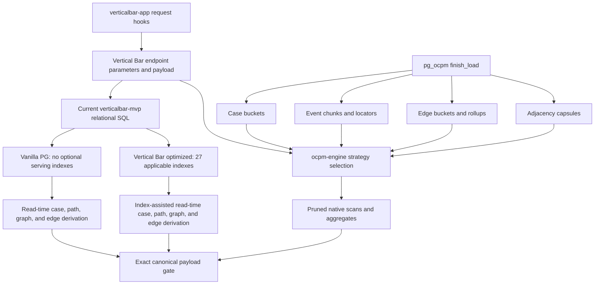

# Three-way Vertical Bar OCPM benchmark on Goodr

## Executive result

This benchmark runs the process-mining request structures emitted by
`verticalbar-app` through the current `verticalbar-mvp` query contract and
compares three PostgreSQL serving designs over the same Goodr-derived facts:

1. **Vanilla PostgreSQL:** current Vertical Bar relational SQL with no optional
   indexes on the benchmark serving relations.
2. **Vertical Bar optimized:** the same current SQL plus every production index
   applicable to the Goodr schema projection, including the current
   `link_adj AS MATERIALIZED` recursive-query optimization.
3. **PostgreSQL with `pg_ocpm 0.2.0`:** the same request parameters and response
   contract routed by `ocpm-engine` to finalized OCPM structures.

All three engines returned identical canonical endpoint payloads for all
**14/14** scenarios.

| Result | Vanilla PostgreSQL | Vertical Bar optimized | PostgreSQL with `pg_ocpm` |
|---|---:|---:|---:|
| Exact endpoint-payload matches | **14/14** | **14/14** | **14/14** |
| Scenario wins | 0/14 | 0/14 | **14/14** |
| Geometric-mean p50 speed versus vanilla | 1.00x | **1.88x** | **35.75x** |
| Geometric-mean p50 speed versus Vertical Bar | 0.53x | 1.00x | **19.06x** |
| Serving indexes | 0.0 MiB | 2,010.0 MiB | **146.0 MiB** |
| Comparable serving storage | 1,818.6 MiB | 3,831.8 MiB | **689.7 MiB** |

The Vertical Bar indexes materially improve selective maps, timelines,
histograms, case paging, and the entire-map aggregation. They do not remove the
read-time case/path/graph derivations, and they regress two broad workloads:

- the unbounded process map is **0.95x** versus vanilla; and
- the saved-project variant list is **0.67x** versus vanilla.

`pg_ocpm` is faster than both relational layouts in every scenario. Its gain
over Vertical Bar optimized ranges from **4.96x** for the exact unbounded
transitive map to **1,460.14x** for the finalized entire-process-map rollup.

The complete machine-readable result is
[`results/verticalbar-goodr-three-way-2026-07-18.json`](results/verticalbar-goodr-three-way-2026-07-18.json)
(SHA-256 `f57ae3a4d5bbe0bd6355b82a46fb3c84db0fbb5afbfa7069990ce169f6086a0d`).

## Workload recovered from the application

The benchmark follows the database reads actually triggered by the web
application:

- project maps with selective, saved-project, unbounded, selected-variant,
  activity, and edge-duration filters;
- variant distribution;
- case-start timeline;
- case-duration histogram;
- selected-edge duration histograms with and without context;
- paginated case detail; and
- the entire process map.

The request shapes come from the pinned application hooks:

- [`useProcessMap`](https://github.com/verticalbarHQ/verticalbar-app/blob/9c6c80d84731fefd63367aac0cf57e5ba51ae5a1/lib/queries.ts#L272-L354);
- [`useEdgeInfo`](https://github.com/verticalbarHQ/verticalbar-app/blob/9c6c80d84731fefd63367aac0cf57e5ba51ae5a1/lib/queries.ts#L356-L442);
- [`useVariants`](https://github.com/verticalbarHQ/verticalbar-app/blob/9c6c80d84731fefd63367aac0cf57e5ba51ae5a1/lib/queries.ts#L444-L523);
- [`useTimeline`](https://github.com/verticalbarHQ/verticalbar-app/blob/9c6c80d84731fefd63367aac0cf57e5ba51ae5a1/lib/queries.ts#L525-L606);
- [`useCaseExecutionTimeHistogram`](https://github.com/verticalbarHQ/verticalbar-app/blob/9c6c80d84731fefd63367aac0cf57e5ba51ae5a1/lib/queries.ts#L641-L722); and
- [`useCaseList`](https://github.com/verticalbarHQ/verticalbar-app/blob/9c6c80d84731fefd63367aac0cf57e5ba51ae5a1/lib/queries.ts#L724-L845).

The scenario set also reflects the application's call structure:

- a project mount requests process map and variants
  ([source](https://github.com/verticalbarHQ/verticalbar-app/blob/9c6c80d84731fefd63367aac0cf57e5ba51ae5a1/views/project-view.tsx#L65-L89));
- the entire-map page requests a year-grained map
  ([source](https://github.com/verticalbarHQ/verticalbar-app/blob/9c6c80d84731fefd63367aac0cf57e5ba51ae5a1/views/entire-process-map-view.tsx#L50-L55));
- hierarchy selection triggers filtered map and variant follow-ups
  ([source](https://github.com/verticalbarHQ/verticalbar-app/blob/9c6c80d84731fefd63367aac0cf57e5ba51ae5a1/components/features/epm/entire-process-map-flow.tsx#L569-L577));
- edge selection optionally includes context
  ([source](https://github.com/verticalbarHQ/verticalbar-app/blob/9c6c80d84731fefd63367aac0cf57e5ba51ae5a1/components/features/project/edge-info-panel.tsx#L74-L98)); and
- the case tab pages in groups of 20
  ([source](https://github.com/verticalbarHQ/verticalbar-app/blob/9c6c80d84731fefd63367aac0cf57e5ba51ae5a1/components/features/project/flow-dashboard-case-tab.tsx#L55-L87)).

## The three implementations

### Vanilla PostgreSQL

The vanilla arm is index-light, not query-naive. It executes the current
`verticalbar-mvp` SQL against identical relational facts, but has no optional
indexes on the benchmark serving relations. Keeping the SQL identical between
the two relational arms isolates the effect of the production physical design.

It therefore includes the current algorithmic improvements, especially the
single materialized bidirectional adjacency CTE and bulk recursive traversal.
It does not revert to an older per-case recursion.

### Vertical Bar optimized

This arm executes the same SQL with all **27** indexes applicable to the
projected Goodr serving schema:

| Relation | Indexes | Role |
|---|---:|---|
| `mv_ocel_event_log` | 4 | object lookup, case/time filtering, case/activity/time filtering, refresh identity |
| `mv_ocel_process_map_edge` | 11 | case, activity pair, time, edge type, source/target object traversal, refresh identity |
| `netsuite_transaction` | 5 | tenant, tenant/id, type, status, created-date filters |
| `vbar_object_actor` | 1 | object-to-actor/context lookup |
| `system_note` | 6 | source-provenance access retained in the serving/storage projection |

The event and edge indexes follow the current materialized-view migration
([event indexes](https://github.com/verticalbarHQ/verticalbar-mvp/blob/01511f921a9d7539ed097e06730eea0273a1a7ec/packages/vbar/db/migrations/versions/20251120_003504_2c54b1bd8eda_bigint_for_netsuite_id.py#L176-L184),
[edge indexes](https://github.com/verticalbarHQ/verticalbar-mvp/blob/01511f921a9d7539ed097e06730eea0273a1a7ec/packages/vbar/db/migrations/versions/20251120_003504_2c54b1bd8eda_bigint_for_netsuite_id.py#L614-L661)).
Transaction indexes are projected from the current model's index definitions
([source](https://github.com/verticalbarHQ/verticalbar-mvp/blob/01511f921a9d7539ed097e06730eea0273a1a7ec/packages/vbar/db/orm/model/netsuite/transaction.py#L189-L389)); indexes for fields absent from the five-column benchmark transaction projection are inapplicable and were not fabricated.

Both relational arms execute the current shared filter pipeline:

1. filter event rows and join transaction attributes;
2. regroup events by case and timestamp;
3. reconstruct selected case paths and durations;
4. hash and aggregate variants;
5. materialize bidirectional link adjacency;
6. recursively carry `backbone_case_id` through connected objects to depth 10;
7. join selected objects back to process edges;
8. apply activity, edge pair, duration, actor, and context filters; and
9. construct the endpoint result.

The implementation is the
[`Filtered_Event_Log` through `Filtered_Edges` pipeline](https://github.com/verticalbarHQ/verticalbar-mvp/blob/01511f921a9d7539ed097e06730eea0273a1a7ec/packages/vbar/insightslib/filter/filter_sets.py#L283-L472).
The graph optimization is the materialized `link_adj` bulk recursion
([source](https://github.com/verticalbarHQ/verticalbar-mvp/blob/01511f921a9d7539ed097e06730eea0273a1a7ec/packages/vbar/insightslib/filter/filter_sets.py#L374-L415)),
and dynamic connected-activity and edge predicates come from the
[in-context filter builder](https://github.com/verticalbarHQ/verticalbar-mvp/blob/01511f921a9d7539ed097e06730eea0273a1a7ec/packages/vbar/insightslib/filter/filter_sets.py#L739-L914).

Endpoint algorithms are taken from:

- [process map, variants, and timeline](https://github.com/verticalbarHQ/verticalbar-mvp/blob/01511f921a9d7539ed097e06730eea0273a1a7ec/apps/api/route/insights/insight.py#L34-L515);
- [case-duration histogram](https://github.com/verticalbarHQ/verticalbar-mvp/blob/01511f921a9d7539ed097e06730eea0273a1a7ec/apps/api/route/insights/insight.py#L516-L647);
- [case paging and detail hydration](https://github.com/verticalbarHQ/verticalbar-mvp/blob/01511f921a9d7539ed097e06730eea0273a1a7ec/apps/api/route/insights/insight.py#L648-L790);
- [selected-edge histogram](https://github.com/verticalbarHQ/verticalbar-mvp/blob/01511f921a9d7539ed097e06730eea0273a1a7ec/apps/api/route/insights/edge.py#L12-L125); and
- [entire process map](https://github.com/verticalbarHQ/verticalbar-mvp/blob/01511f921a9d7539ed097e06730eea0273a1a7ec/apps/api/route/insights/repo.py#L18-L140).

### PostgreSQL with `pg_ocpm`

`ocpm-engine` preserves the application request/response contract while
routing each request to a specialized finalized representation:

- event chunks and object locators;
- path-keyed case buckets with exact timestamp payloads;
- aligned directly-follows edge buckets;
- compressed adjacency capsules;
- exact edge and case-start rollups; and
- native array/capsule scans and aggregates.

The planner selects case windows versus segmented case buckets, and one-hop
versus transitive process-map traversal
([planner](../src/ocpm_engine/engine.py#L59-L209)). Parameterized endpoint SQL
is in [`queries.py`](../src/ocpm_engine/queries.py#L3-L692).

The underlying serving structures are defined by the pinned
[`pg_ocpm 0.2.0` schema](https://github.com/verticalbarHQ/pg_ocpm/blob/8dc32adef27e50e492f1047c526cad89cf0b66d8/sql/pg_ocpm--0.2.0.sql#L297-L622),
and [`ocpm.finish_load(...)`](https://github.com/verticalbarHQ/pg_ocpm/blob/8dc32adef27e50e492f1047c526cad89cf0b66d8/sql/pg_ocpm--0.2.0.sql#L1071-L1648)
builds the deterministic finalized representation.

## Architecture

The main difference is architectural. The Vertical Bar indexes make existing
relational stages cheaper; `pg_ocpm` removes many of those stages from request
time by finalizing stable OCPM derivations when the dataset is refreshed.

## Algorithm mapping

| Application operation | Current relational algorithm | `pg_ocpm` algorithm | Request-time work removed |
|---|---|---|---|
| Filtered process map | Rebuild case paths, adjacency, case-aware closure, edge join, aggregation | Select finalized cases, traverse capsules, scan candidate edge buckets | Case/path derivation and row-wise edge aggregation |
| Selected variant map | Rebuild and hash paths before graph expansion | Filter persisted `path_hash` before capsule traversal | Path sorting, JSON construction, broad traversal seed |
| Activity-filtered map | Filter event groups, then connected activity after expansion | Filter persisted activity sets and aligned edge arrays | Unnecessary case and edge expansion |
| Edge-duration map | Join selected objects to row edges, then apply pair/duration predicates | Time/pair prune buckets, then scan aligned duration arrays | Broad edge join and tuple materialization |
| Variant distribution | Sort/regroup events, construct paths, hash/group | Aggregate persisted paths with exact boundary fallback | Lifecycle sort, path construction, hashing |
| Case timeline | Rebuild cases and calculate starts | Bucket stored case starts | Event grouping and per-case minima |
| Case-duration histogram | Recompute case minima/maxima and duration | Aggregate stored exact durations | Lifecycle duration derivation |
| Selected-edge histogram | Run recursive graph pipeline, join candidate edges, bin | Expand selected capsules and scan pruned edge arrays | Recursive row graph and broad edge join |
| Case page | Derive all cases, recurse, page, then rejoin detail | Page finalized cases first, then hydrate exact event slices and edges | Hydration outside the requested page |
| Entire process map | Scan/group all edges and derive case starts | Read finalized edge and case-start rollups | Whole-dataset DFG and start-time derivation |

## Goodr dataset

| Fact family | Count |
|---|---:|
| Events | 2,471,989 |
| Process edges | 3,152,848 |
| Cases/objects | 1,250,972 |
| Objects with actor/context data | 10,296 |
| Distinct contexts represented | 6 |
| Distinct users represented | 5 |

All arms contain the same logical facts. The relational storage scope contains
the event log, process edges, projected transactions, actor lookup, and source
provenance. The current MVP builds timestamp grouping as a request-time CTE, so
the benchmark does not count a separate persisted timestamp-group table. Raw
Goodr import tables are excluded from every serving-storage total.

## Method

| Setting | Value |
|---|---|
| PostgreSQL | 16.14 in separate Docker services |
| `pg_ocpm` | 0.2.0, clean-built current source |
| `shared_buffers` | 1 GiB |
| `effective_cache_size` | 4 GiB |
| Session `work_mem` | 1 GiB, matching the current handlers |
| `maintenance_work_mem` | 1 GiB |
| Parallel workers per gather | 4 |
| `random_page_cost` | 1.1 |
| JIT | Disabled |
| Warmups | 2 per scenario and engine |
| Measured runs | 9 per scenario and engine |
| Engine order | Randomized every pass, seed `20260718` |
| Statement timeout | 120 seconds per database query |
| Result cache | Disabled and emptied |
| Correctness gate | Exact canonical JSON across all three engines |
| Latency scope | Client-observed database query wall time |

A cold warmup timeout does not disqualify an engine; only measured-run
timeouts count. This matters for the 25-second unbounded relational query: an
earlier harness version incorrectly treated a cold warmup as a final result.
The corrected final run completed all measured queries with no timeout.

The benchmark is warm-cache, single-client database latency. It excludes HTTP,
application serialization, browser rendering, concurrent throughput,
ingestion, WAL volume, and `finish_load` duration.

Captured source hashes were rechecked before the run. The benchmark's
`pg_ocpm` endpoint SQL is byte-equivalent to the current `ocpm-engine` query
constants, including all four one-hop/closure and filtered/unfiltered
process-map strategies.

| Component | Revision |
|---|---|
| `verticalbar-app` | `9c6c80d84731fefd63367aac0cf57e5ba51ae5a1` |
| `verticalbar-mvp` | `01511f921a9d7539ed097e06730eea0273a1a7ec` |
| `ocpm-engine` | `3d8a3dbddd042156ef938a400116260d604ae433` |
| `pg_ocpm` | `8dc32adef27e50e492f1047c526cad89cf0b66d8` |

## Latency results

### p50 latency and speedup

| Goodr application scenario | Endpoint | Vanilla p50 ms | Vertical Bar p50 ms | `pg_ocpm` p50 ms | VB/vanilla | `pg_ocpm`/vanilla | `pg_ocpm`/VB | Exact |
|---|---|---:|---:|---:|---:|---:|---:|:---:|
| Selective 6-hour project map | `process_map` | 436.05 | 116.08 | 5.95 | 3.76x | 73.26x | 19.50x | yes |
| Saved-project process map | `process_map` | 1,268.23 | 994.49 | 114.00 | 1.27x | 11.12x | 8.72x | yes |
| Unbounded process map | `process_map` | 25,066.36 | 26,448.65 | 5,335.39 | 0.95x | 4.70x | 4.96x | yes |
| Selected-variant process map | `process_map` | 440.29 | 142.23 | 19.16 | 3.10x | 22.97x | 7.42x | yes |
| Activity-filtered process map | `process_map` | 638.91 | 375.08 | 67.67 | 1.70x | 9.44x | 5.54x | yes |
| Edge-duration-filtered process map | `process_map` | 1,721.24 | 1,449.96 | 56.88 | 1.19x | 30.26x | 25.49x | yes |
| Saved-project variant list | `variant_list` | 77.34 | 115.44 | 9.73 | 0.67x | 7.95x | 11.87x | yes |
| Unbounded variant list | `variant_list` | 1,219.94 | 1,207.63 | 142.11 | 1.01x | 8.59x | 8.50x | yes |
| Case timeline dashboard | `timeline` | 397.59 | 160.79 | 10.94 | 2.47x | 36.33x | 14.69x | yes |
| Case-duration histogram | `case_throughput` | 400.64 | 161.78 | 10.49 | 2.48x | 38.19x | 15.42x | yes |
| Selected-edge histogram | `edge_info` | 392.65 | 104.30 | 0.90 | 3.77x | 438.23x | 116.40x | yes |
| Selected-edge context histogram | `edge_info` | 635.72 | 341.16 | 14.08 | 1.86x | 45.15x | 24.23x | yes |
| Case-list first page | `case_list` | 565.08 | 246.50 | 24.60 | 2.29x | 22.97x | 10.02x | yes |
| Entire process map | `entire_process_map` | 6,872.56 | 1,947.82 | 1.33 | 3.53x | 5,151.84x | 1,460.14x | yes |

### p95 latency

| Goodr application scenario | Vanilla p95 ms | Vertical Bar p95 ms | `pg_ocpm` p95 ms |
|---|---:|---:|---:|
| Selective 6-hour project map | 556.05 | 162.29 | 6.60 |
| Saved-project process map | 2,253.25 | 1,726.99 | 121.80 |
| Unbounded process map | 27,624.69 | 27,721.37 | 5,637.31 |
| Selected-variant process map | 486.60 | 205.97 | 20.63 |
| Activity-filtered process map | 679.61 | 410.16 | 84.72 |
| Edge-duration-filtered process map | 1,731.87 | 1,475.81 | 58.27 |
| Saved-project variant list | 79.87 | 121.13 | 10.12 |
| Unbounded variant list | 1,449.51 | 1,253.04 | 147.06 |
| Case timeline dashboard | 414.44 | 171.42 | 11.03 |
| Case-duration histogram | 489.32 | 288.45 | 18.04 |
| Selected-edge histogram | 407.12 | 108.60 | 0.94 |
| Selected-edge context histogram | 699.77 | 346.68 | 14.36 |
| Case-list first page | 624.26 | 276.71 | 27.55 |
| Entire process map | 7,102.48 | 2,092.16 | 2.75 |

### Results by algorithm family

| Family | Scenarios | VB/vanilla geomean | `pg_ocpm`/vanilla geomean | `pg_ocpm`/VB geomean |
|---|---:|---:|---:|---:|
| Filtered process map | 6 | 1.75x | 17.12x | 9.80x |
| Variant distribution | 2 | 0.82x | 8.26x | 10.04x |
| Case timeline | 1 | 2.47x | 36.33x | 14.69x |
| Case-duration histogram | 1 | 2.48x | 38.18x | 15.42x |
| Selected-edge histogram | 2 | 2.65x | 140.67x | 53.11x |
| Case pagination/hydration | 1 | 2.29x | 22.97x | 10.02x |
| Entire process map | 1 | 3.53x | 5,151.84x | 1,460.14x |

## Why the results differ

### Indexes accelerate selective access but not derivation

The Vertical Bar layout is strongest when predicates select a small portion of
event or edge rows. The selective six-hour map gains **3.76x**, the selected
edge histogram **3.77x**, and the entire map **3.53x**.

The layout still reconstructs case paths, adjacency, connected objects, and
endpoint aggregates at read time. On the unbounded map, index probes are not
selective enough to offset their random-access overhead, and the optimized arm
is **5.5% slower** than the index-light sequential-scan plan. The saved-project
variant list is **49.3% slower** because the low-cost vanilla scan/aggregate is
cheaper than the selected index-driven path at that cardinality.

### `pg_ocpm` removes stable work from the request path

For variants, timelines, and case-duration histograms, persisted case paths,
hashes, starts, ends, and durations eliminate repeated lifecycle reconstruction.
The gains over Vertical Bar optimized are **8.50x to 15.42x**.

For selected-edge histograms, capsule expansion and pruned aligned edge arrays
avoid relational recursive graph materialization and broad edge joins. The
gains are **24.23x to 116.40x**.

The entire process map reads finalized exact rollups instead of grouping 3.15
million edges and deriving 1.25 million case starts. The measured
**1,460.14x** gain is therefore a write/read tradeoff, not a claim that native
code makes an arbitrary `GROUP BY` 1,460x faster.

### Exact unbounded closure remains the hardest `pg_ocpm` query

The unbounded project map takes **5.34 seconds** p50 in `pg_ocpm`. It is still
**4.96x** faster than Vertical Bar optimized, but it performs many exact
case-aware adjacency capsule lookups. A persisted component/closure structure
or batched case-to-component map is the clearest remaining performance target.

## Storage and index usage

### Serving storage

| Serving representation | Heap | TOAST | Indexes | Total | Relative to vanilla |
|---|---:|---:|---:|---:|---:|
| Vanilla relational PostgreSQL | 1,817.9 MiB | 0.7 MiB | 0.0 MiB | 1,818.6 MiB | 1.00x |
| Vertical Bar optimized | 1,821.0 MiB | 0.7 MiB | 2,010.0 MiB | 3,831.8 MiB | 2.11x |
| Finalized `pg_ocpm` schema | 361.3 MiB | 182.4 MiB | 146.0 MiB | **689.7 MiB** | **0.38x** |

Relative to Vertical Bar optimized, `pg_ocpm` uses:

- **82.0% less total serving storage**;
- **92.7% less index storage**;
- **5.56x less total space**; and
- **13.76x less index space**.

Relative to the index-light relational representation, `pg_ocpm` is **62.1%
smaller overall**, even though it includes its complete specialized index set.
Adding the applicable Vertical Bar indexes increases the relational serving
footprint by **110.7%**.

The larger `pg_ocpm` TOAST component is intentional: repeated row values are
packed into compressed event, case, edge, and adjacency arrays/capsules rather
than repeated across heap and B-tree tuples.

### Observed index utilization

Counters were reset immediately before the final suite.

| Engine | Sequential tuples read | Index scans | Index tuples read | Index cache hit rate |
|---|---:|---:|---:|---:|
| Vanilla PostgreSQL | 1,995,680,346 | 0 | 0 | n/a |
| Vertical Bar optimized | 54,383,758 | 29,032,058 | 145,947,307 | 99.52% |
| PostgreSQL with `pg_ocpm` | 44,869 | 11,066,759 | 11,104,621 | 100.00% |

Only **11 of 27** Vertical Bar indexes were scanned by these 14 application
scenarios. The **16 unused indexes occupy 1,099.3 MiB**. “Unused” here means
unused by this benchmark workload, not safe to drop globally: ingestion,
refresh, administration, or other application paths may require them.

The active Vertical Bar indexes are dominated by:

- edge target-object traversal: 12.19 million scans;
- event case/time lookup: 11.62 million scans;
- transaction tenant/id lookup: 5.22 million scans; and
- lower-frequency edge pair, edge type, time, status, and type probes.

The `pg_ocpm` index workload is smaller in bytes and tuples but still includes
11.1 million exact adjacency lookups, which explains why unbounded transitive
closure remains measured in seconds.

### Replacement versus additive deployment

The **82.0%** reduction applies when `pg_ocpm` replaces the listed relational
serving representation after cutover. A side-by-side migration temporarily
adds 689.7 MiB to the 3,831.8 MiB Vertical Bar representation, for about
4,521.4 MiB total, until redundant tables and indexes are retired.

## Correctness gate

Each scenario was accepted only after all three engines completed and their
canonical endpoint JSON values were identical. The gate covers:

- node and edge identities and object types;
- case and frequency counts;
- activity paths and hashes;
- timeline buckets;
- duration minima, maxima, means, medians, and deviations;
- actor/context groupings;
- case detail, connected objects, activities, and edges; and
- deterministic ordering and rounding.

All **14/14** scenarios passed. No timeout or mismatch was included in any
geometric mean because the corrected final run had none.

## Conclusions

1. **The current Vertical Bar query algorithm is present in both relational
   arms.** The 1.88x result isolates the applicable 27-index physical design;
   it is not a comparison against obsolete recursion.
2. **Indexes help the known selective workload but are not sufficient for
   OCPM derivation.** They accelerate most scenarios yet regress the two broad
   variant/closure cases and more than double serving storage.
3. **`pg_ocpm` runs the Vertical Bar request contract most effectively through
   specialized plans.** It preserves every tested payload while achieving a
   19.06x geomean over the fully indexed Vertical Bar layout.
4. **The storage advantage is also material.** The finalized schema uses 689.7
   MiB versus 3,831.8 MiB for the indexed relational representation.
5. **Unbounded exact closure remains the latency outlier.** It is substantially
   faster with `pg_ocpm`, but 5.34 seconds is still above a strict interactive
   target and warrants a component/closure follow-up.
6. **Write and concurrency costs remain unmeasured.** A production decision
   should additionally benchmark refresh latency, WAL, incremental updates,
   concurrent p95/p99 throughput, and temporary dual-representation capacity.

The recommended Vertical Bar architecture is to keep the application's
request and response contracts, use `ocpm-engine` as the routing/planning
layer, and serve the tested operations from `pg_ocpm` finalized primitives
rather than reproducing the relational CTE pipeline table-for-table.
